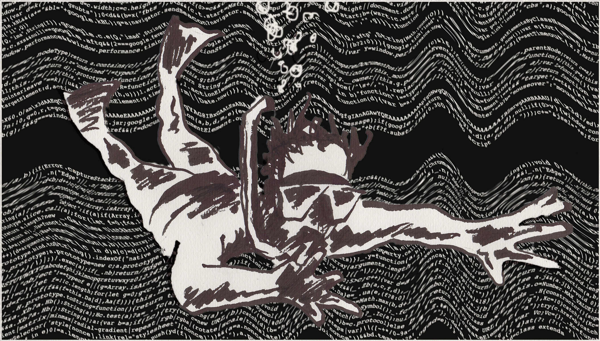

# Oppdrift: Backend

Kursstøttemateriell til Oppdrift - Backend

- [Økt[0]](./del_0/README.md) (Nettverk & arkitektur)
- [Økt[1]](./del_1/README.md) (Databaser & patterns)
- [Økt[2]](./del_2/README.md) (Api-design & testing)
- Økt[3] (Rammeverk & deployment)