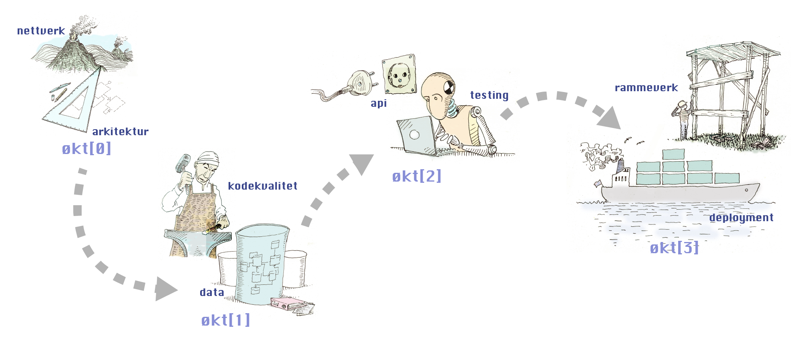

# Oppdrift: Backend


[Wikipedia:](https://en.wikipedia.org/wiki/Frontend_and_backend)
> In software engineering, the terms frontend and backend (or sometimes referred to as back end or back-end) refer to the separation of concerns between the presentation layer (frontend), and the data access layer (backend) of a piece of software, or the physical infrastructure or hardware. In the client–server model, the client is usually considered the frontend and the server is usually considered the backend, even when some presentation work is actually done on the server itself.

## Kursstøttemateriell til Oppdrift - Backend

- [Økt[0]](./del_0/README.md) (Nettverk & arkitektur)
- [Økt[1]](./del_1/README.md) (Databaser & patterns)
- [Økt[2]](./del_2/README.md) (Api-design & testing)
- [Økt[3]](./del_3/README.md) (Rammeverk & deployment)



---

Powerpoint-presentasjonene er lagret med [LFS](https://git-lfs.com/). For å åpne dem, er det enkleste å åpne dem fra [Github](https://github.com/bekk/oppdrift_backend/). 

[Avinstallering etter kurset](./avinstallering.md)

```console
git clone --recurse-submodules git@github.com:bekk/oppdrift_backend.git
```