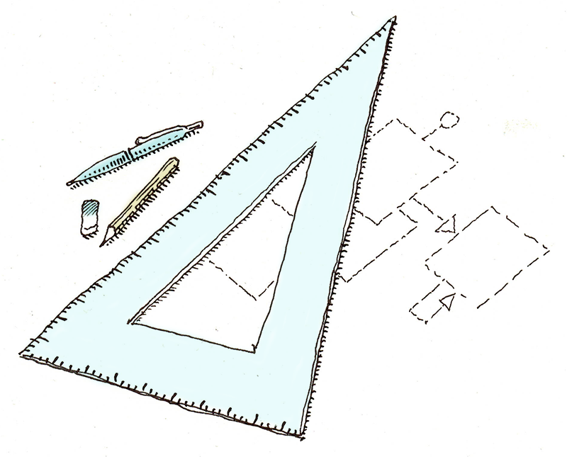
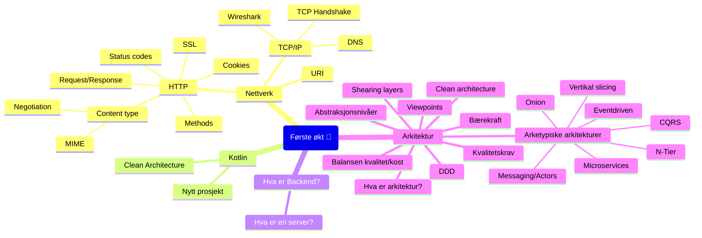

# Program for Oppdrift Backend første økt

Innholdet i denne økten består i hovedak av to deler; Nettverk og arkitektur.

## Backend

Backend er på mange måter definert av hva det *ikke* er: Det er ikke frontend.

Backend er den delen brukerne ikke ser. Det er den delen som håndterer autentisering 
og sikkerhet. det skrives vanligvis i [andre språk](https://blog.back4app.com/backend-languages/) enn frontend.

Det er i backend vi håndterer ytelse, dataaksess og integrasjoner.

## Nettverk


I denne delen ser vi nærmere på konsepter rundt nettverks om er relevant
i backend-programmering. Fokuset er naturlig nok på HTTP og TCP/IP.

### Hva er en server?

*Server* oversatt til norsk er «servitør». Det er med andre ord en tjeneste som serverer noe en *client* (kunde) ber om.

Det kan være et rammeverk eller en run-time for vår kode.

I denne sammenhengen kan vi avgrense det til HTTP-servere. Vi kan ha flere servere i en løsning, som enten kaller hverandre, 
eller som ligger som lag utenpå hverandre, og som har ulike roller.

På JVM er en HTTP-server vanligvis kode som implementerer en «web container».

- [Web container](https://en.wikipedia.org/wiki/Jakarta_Enterprise_Beans)

### Web server – lett forenklet

De fleste http-servere følger de samme overordnede prinsippene.

- **HTTP**: De forstår HTTP-protokollen. De kan motta en *request* og svarer med en *response*.
- **Scalable**: De er laget for å kunne behandle mange samtidige henvendelser.
- **Stateless**: I utgangspunktet er HTTP designet slik at det ikke er nødvendig å lagre tilstandsdata mellom to requester. Det gjør det enklere å behandle mange av dem raskt.
- **Single threaded**: Det er vanligvis slik at en request ikke behandles med parallell kode. Ved å håndtere en request i en enkel tråd er det lettere å kontrolle skalering.
- **Secure**: Serveren er lagt opp til at det er mulig å bygge sikre løsninger.

### Event-driven/Thread-based

Det er to ulike arkitekturer i web-servere; trådbasert eller hendelsesdrevet.

#### Thread-based

Hver request håndteres i en tråd. Å håndtere en thread-pool er en vesentlig del av serverens funksjonalitet.
Requester kan håndteres i parallell, men hver enkelt av dem har bare en tråd tilgjengelig.

Tråder er kostbare å opprette og håndtere. Om det kommer flere samtidige request, og det ikke er nok tilgjengelige tråder,
må requester køes opp eller avvises. Om de køes opp fører det til høyere *latency*.

#### Event-driven

Serveren kjører på én tråd, og håndterer requester sekvensielt som hendelser. Dette gir lavere overhead,
siden serveren ikke trenger å håndtere tråder og isolere samtidige requests.

Om requesten må vente på IO-operasjoner (for eksempel database) gis tråden tilbake til neste request.
Slik unngår man blokkeringer pga IO.

### Middleware

Et vanlig pattern for servere er at de implementeres som en bunke av mellomvaremoduler (middleware). De ligger oppå hverandre
i en definert rekkefølge.

Innkommende requester blir tatt i mot av første mellomvare. Om det er relevant, vil den svare med en response. Om ikke sendes den videre til neste modul.

### MVC

Model-View-Controller er et pattern for applikasjoner med grafisk brukergrensesnitt (GUI) som kom ut av Simula-miljøet ved
universitet i Oslo på 70–tallet, med Trygve Reenskau i spissen.

Det innebærer at en **Controller** har ansvar for å motta input fra brukeren.
Den kaller så en **Model** som returnerer data som kan brukes yil å bygge et **View**.
View er altså en presentasjon for brukeren. Modellen er kombinasjonen av datastruktur og forretningslogikk.
Controlleren har ansvar for å sette dette sammen og returnere det til brukeren.

Dette ble tatt opp i Java med Web Objects og Spring, og er sentrale abstraksjoner i Spring ennå.
Vi kan finne begrepene brukt i svært mange web-rammeverk i dag. Som regel er det tilknyttet en **Router**
som har ansvar for å knytte request til den riktige Controller.

- [Wikipedia](https://en.wikipedia.org/wiki/Model%E2%80%93view%E2%80%93controller)
- [Trygve Reenskaug](https://en.wikipedia.org/wiki/Trygve_Reenskaug)

## HTTP

Denne protokollen er grunnstenen i nesten alle webløsninger vi lager. 
Det er fornuftig å investere litt i å forstå hvordan den virker.

- [Wikipedia](https://en.wikipedia.org/wiki/HTTP)
- [Dokumentasjon](https://httpwg.org/specs/)
- [MDN](https://developer.mozilla.org/en-US/docs/Web/HTTP)

### URI/URL

Hva vi kaller dette er avhengig av anvendelsen – hva vi bruker den til.
Syntaksen er lik for alle.

- [URI](https://datatracker.ietf.org/doc/html/rfc3986#section-1.1): Uniform Resource Identifier
- [URL](https://url.spec.whatwg.org/): Uniform Resource Locator
- [IRI](https://datatracker.ietf.org/doc/html/rfc3987): Internationalized Resource Identifier
- [URN](https://en.wikipedia.org/wiki/Uniform_Resource_Name): Uniform Resource Name

En URI består av delene:

1) **Scheme**: Står foran første kolon. Beskriver ofte hvilken protokoll som skal brukes. F.eks `https` eller `mailto`
2) **User Info**: Et brukernavn og passord, adskilt med `:`. Etter *User info* kommer en `@`.
3) **Authority**: Beskriver som regel serveren det refereres til. Består av **Host** (domenenavn eller ip-adresse) og **Port** som kan være implisitt gitt av *Scheme*.
4) **Path**: En peker til en gitt ressurs på serveren. Syntaksen er hentet fra UNIX' filsystem.
5) **Query**: Argumenter som sendes med på formen `key=value`. De skilles fra *Path* med `?` og separeres seg i mellom med `&`.
6) **Fragment**: På enden, separert med `#` kan det være en *Fragment*. Denne er kun ment for klienten, og sendes ikke med fra nettleseren til server. *Fragment* er derfor ikke tilgjengelig i backend.

Bare *Scheme* og *Path* er obligatorisk.

```ABNF
URI           = scheme ":" hier-part [ "?" query ] [ "#" fragment ]

hier-part     = "//" authority path-abempty
              / path-absolute
              / path-rootless
              / path-empty

scheme        = ALPHA *( ALPHA / DIGIT / "+" / "-" / "." )

authority     = [ userinfo "@" ] host [ ":" port ]
userinfo      = *( unreserved / pct-encoded / sub-delims / ":" )
host          = IP-literal / IPv4address / reg-name
port          = *DIGIT

path-abempty  = *( "/" segment )
path-absolute = "/" [ segment-nz *( "/" segment ) ]
path-rootless = segment-nz *( "/" segment )
path-empty    = 0<pchar>

segment       = *pchar
segment-nz    = 1*pchar
pchar         = unreserved / pct-encoded / sub-delims / ":" / "@"

query         = *( pchar / "/" / "?" )

fragment      = *( pchar / "/" / "?" )

pct-encoded   = "%" HEXDIG HEXDIG

unreserved    = ALPHA / DIGIT / "-" / "." / "_" / "~"
reserved      = gen-delims / sub-delims
gen-delims    = ":" / "/" / "?" / "#" / "[" / "]" / "@"
sub-delims    = "!" / "$" / "&" / "'" / "(" / ")"
              / "*" / "+" / "," / ";" / "="

```

### Versjoner

Første versjon av protokollen, `HTTP/0.9` kom i 1991. Versjonsnummeret kom senere.

`HTTP/1.0` kom i 1996. Statuskoder og headere var på plass.

Året etter kom `HTTP/1.1`. Den hadde en mer avansert modell for å gjenbruke koblinger, 
caching og content negotiation.

`HTTP/2.0` kom i 2015. Den har samme semantikk som forrige versjon, men er en binærprotokoll.
Det er støtte for multipleksing, komprimering av headere og streaming.

`HTTP/3` bruker QUIC i stedet for TCP, og støtter også multi-streaming over UDP.

- [Sammenligning av versjonene](https://www.baeldung.com/cs/http-versions)

### Request/Response

En HTTP-request (og respons) kan konseptuelt ses på som en tekstfil.

Første linjen i en request består av *metoden* (`GET`, `POST` etc), en *path* og *protokollen*.
For eksempel: `GET /hvem-vi-er HTTP/1.1`.

Under denne kommer headere på formen `key: value`. For eksempel: `Host: www.bekk.no`.

Etter alle headerne kommer en tom linje, og deretter eventuelt resten av meldingen (*message body*).

En HTTP-respons har samme formatet, bortsett fra for første linje.
Den består av *protokollen*, *statuskoden* og *statusmelding*.
For eksempel `HTTP/1.1 301 Moved Permanently`.

- https://developer.mozilla.org/en-US/docs/Web/HTTP/Overview

### Method

Metoden, eller verbet, beskriver hensikten med en request. De vanligste er:

#### GET

Denne brukes for å hente en ressurs. Den er definert som *Safe*, da den ikke skal ha noen
sideeffekter på serveren. Det er med andre ord brudd på standarden å gjøre endringer på serveren
som en følge av et GET-kall. Logging og caching er unntak fra denne regelen.
En GET-request har ikke definert en body. Det vil si at om klienten sender med innhold 
i meldingen, er det ikke garantert at serveren leser innholdet.

#### POST

Denne brukes for å opprette en ressurs. Denne er ikke *Safe*, siden dette fører til en endring på server.
Hver gang det gjøres et POST-kall opprettes en ny ressurs. Det er derfor nettleseren advarer deg
om du forsøker å gjenta en POST.

#### PUT

Denne brukes til å oppdatere en eksisterende ressurs med en ny definisjon.
Dersom ressursen ikke finnes fra før, blir den opprettet på server (som med en POST).
Denne metoden er definert som *Idempotent*. Det betyr at flere gjentatte kall ikke fører til en annen 
effekt enn det ett kall har.

#### DELETE

Denne sletter en ressurs. Den er også definert som *Idempotent*.

#### PATCH

Denne metoden oppdaterer deler av en ressurs. Det er ikke definert hvordan meldingen skal se ut for å beskrive 
hvilke deler som skal oppdateres. Et forsøk på å lage en standard for dette 
finnes i [JSON Patch](https://jsonpatch.com/).
Patch er også *Idempotent*.

- https://developer.mozilla.org/en-US/docs/Web/HTTP/Methods
- https://httpwg.org/specs/rfc9110.html#rfc.section.9.3
- [QUERY](https://www.w3.org/2012/ldp/wiki/Proposal_for_HTTP_QUERY_Verb)

### Status Codes

En HTTP-response inneholder alltid en statuskode i første linjen. Den indikerer utfallet av prosesseringen
av requesten.

Statuskoden er et tresifret tall. Det finnes fem grupper av tall:

- **100-199 Informational**: Brukes for å informere klienten, for eksempel om skifte av protokoller (`101`).
- **200-299 Success**: Indikerer at alt gikk bra.
- **300-399 Redirection**: Informerer klienten om at den skal gå videre til en annen adresse. Denne adressen er da inkludert i en header (`Location`).
- **400-499 Client error**: Noe er galt med requesten, så den ikke kan behandles. Det kan være at ressursen ikke finnes (`404`) eller at brukeren ikke har rettigheter (`401`).
- **500-599 Server error**: En feil på server gjør at requesten ikke kan behandles.

Det er ingen offesielle koder over 511. 

- [Status Code Registry](https://www.iana.org/assignments/http-status-codes/http-status-codes.xhtml)
- [MDN](https://developer.mozilla.org/en-US/docs/Web/HTTP/Status)
- [RFC 2324 🫖](https://www.rfc-editor.org/rfc/rfc2324)

### Content negotiation

Klient og server kan kommunisere om formatet på innholdet serveren skal servere.
Dette gjøres med deikerte headere.

- **Accept**: Beskriver innholdstypen klienten forstår. Det kan være en liste av flere. 
  Det kan også beskrive tegnsett (som f.eks `utf-8`).
- **Accept-Language**: Språket tekst og annet innhold skal være på.
- **Accept-Encoding**: Hvilke komprimeringsalgoritmer og lignende klienten forstår.

Serveren svarer med korresponderende headere.

- **Content-Type**: Innholdstypen på innholdet i meldingen. For eksempel `text/html; charset=utf-8`.
- **Content-Language**
- **Content-Encoding**

Serveren kan også svare med status-koder om den ikke er i stand til å velge en innholdstype
som tifredsstiller ønsket fra klienten. `406 (Not Acceptable)`, `415 (Unsupported Media Type)`
eller `300 (Multiple Choices)`. 

- [MDN](https://developer.mozilla.org/en-US/docs/Web/HTTP/Content_negotiation)

### Content-type

Innholdstype (eller mediatype) er kodifisert i en standard som kalles «MIME» (Multipurpose Internet Mail Extensions).
Formatet består av en type og en undertype slik `type/subtype`.

De offisielle hovedtypene er:
application,
audio,
font,
example,
image,
message,
model,
multipart,
text,
video

- [MDN](https://developer.mozilla.org/en-US/docs/Web/HTTP/Basics_of_HTTP/MIME_types)
- [Offisiell liste](https://www.iana.org/assignments/media-types/media-types.xhtml)

### Cookies

Cookies (fra «[Magic Cookie](https://en.wikipedia.org/wiki/Magic_cookie)» brukt i Unix) er en metode
for å sende med informasjon mellom klient og server, og på den måten kunne ha state mellom requester.

Server instruerer klienten til å lagre cookie ved å sende med en header `Set-Cookie` der verdien er innholdet
som skal lagres.

Klienten sender cookie tilbake til server med headeren `Cookie`.

Semantikken for cookies er definert i nettleserne, og styrer hvorvidt klienten sender cookien tilbake til server.

- [MDN](https://developer.mozilla.org/en-US/docs/Web/HTTP/Cookies)
- [Wikipedia](https://en.wikipedia.org/wiki/HTTP_cookie)

### CSP

*Content Security Policy* instruerer nettleseren om hvilke andre domener den skal kunne laste ned script fra i 
sammenheng med rendring av en nettside.
Til dette brukes headeren `Content-Security-Policy` (eller `<meta>`-elementet i HTML).

- [MDN](tps://developer.mozilla.org/en-US/docs/Web/HTTP/CSP)

### CORS

*Cross-Origin Resource Sharing* kan begrense hvilke nettsider som skal kunne laste ned en ressurs.
Når en nettside fra et annet domene ber nettleseren om å laste ned en ressurs 
der en `Access-Control-Allow-Origin`-header ikke tillater det, vil nettleseren ikke laste inn ressursen.

- [MDN](https://developer.mozilla.org/en-US/docs/Web/HTTP/CORS)

### Encoding

En *Code page* bestemmer hvordan tegn skal representeres med tall (code unit). Det er bare problematisk for tegn utenfor
det amerikanske alfabetet (ASCII-tabellen < 128), da de første syv bits er entydig koblet til tegn.

Unicode er den desisdert vanligste måten å koble tegn til en tall-representasjon.

*Encoding* er metoden for å representere dette tallet binært i minnet og i kommunikasjon.
Fordi Unicode består av mange tegn, finnes det ulike måter å komprimere representasjonen, 
så ikke alle tegne må representeres med et stort binært tall.

`UTF-8` er den vanligste metoden for encoding i HTTP.

- [Wikipedia (Code page)](https://en.wikipedia.org/wiki/Code_page)
- [Unicode](https://home.unicode.org/)
- [Wikipedia (Encoding)](https://en.wikipedia.org/wiki/Character_encoding)
- [UTF-8](https://www.ietf.org/rfc/rfc3629.txt)

### SSL/TLS

Med *Scheme* `https` kreves det at kommunikasjonen er kryptert mellom server og klient.
*TLS* er protokollen som regnes som sikrest. Den bruker en metode for å utveksle
informasjon mellom klient og server (SSL handshake), så man kan gå fra assymetrisk kryptering til symmetrisk kryptering
(som er mindre ressurskrevende).

## Nettverkstruktur

### Stack

Dette er et begrep og pattern/datastruktur/arkitektur som går igjen i veldig mange sammenhenger.
Elementer kan ligge utenpå hverandre, og abstraksjonen kan forhindre at informasjonen går mer enn en vei.

### OSI Network stack

Dette er en standardisert måte å strukturere nettverk på. Nederst er det fysiske laget, øverst er 
applikasjonslaget. Hvert lag baserer seg på laget under.

En stor fordel med dette er at en implementasjon av de øvre lagene er helt uavhengig av hva slags
fysisk nettverk det er. Applikasjonen er den samme for Wi-fi som for Ethernet.

- [Wikipedia](https://en.wikipedia.org/wiki/OSI_model)

### TCP/IP stack

TCP/IP har en forenklet modell, sammenlignet med OSI-modellen. TCP gikk i drift første gang i januar 1983.

I øverste laget ligger applikasjonsprotokollene, slik som `HTTP`, `DNS` og `SMTP`.
Tradisjonelt har disse protokollene basert seg på enten `UDP`eller `TCP`i laget under. `TCP`garanterer levering,
mens `UDP` er en lettere protokoll som ikke garanterer levering.

Nyere protokoller som `TLS` og `QUIC` ligger på mange måter i både applikasjon- og transportlaget.

- `UDP`: User Datagram Protocol
- `HTTP`: Hypertext Transfer Protocol
- `DNS`: Domain Name System
- `FTP`: File transfer Protocol
- `DHCP`: Dynamic Host Configuration Protocol
- `SMTP`: Simple Mail Transfer Protocol
- `TLS`: Transport layer Security
- `QUIC`: Quick UDP Internet Connections
- `TCP`: Transmission Control Protocol
- `NAT`: Network Address Translation
- `ICMP`: Internet Control Message Protocol
- `RIP`: Routing Information Protocol
- `BGP`: Border Gateway Protocol
- `ARP`: Address Resolution Protocol


- [Wikipedia](https://en.wikipedia.org/wiki/Internet_protocol_suite)

### Wireshark

Dette er et verktøy for å inspisere nettverkstrafikk på egen maskin. Det kan være nyttig for å se
de ulike protokollene i sammenheng.

- [Wireshark](https://www.wireshark.org/)

### DNS

DNS (Domain Name System) er en protokoll for å slå opp et domenenavn for å finne en ip-addresse.
Det kan ses på som en distribuert database.

Det finnes noen verktøy det er greit å være kjent med:

- `nslookup` Et kommandolinjeverktøy for å slå opp IP-addressen til et domene.
- `traceroute` (`tracert` i Windows) viser veien datapakkene tar i nettet.
- `ping` tester kommunikasjonen med en server.

Når maskinen skal finne en ip-adresse ser den først i den lokale `host`-filen, før den sjekker egen cache og 
deretter gjør et kall til en DNS-server.
Den ligger i `/etc/hosts` (`C:\Windows\System32\drivers\etc\hosts`i Windows). Det er her _localhost_ er 
definert som `127.0.0.1`.

- [Wikipedia](https://en.wikipedia.org/wiki/Domain_Name_System)

### TCP Handshake

For å opprette en TCP-kommunikasjon gjør klienten en handshake med serveren.
Det består av en `SYN`-melding. Den blir besvart med `SYN ACK`, som deretter blir bekreftet med en `ACK`.

Da er det opprettet en «kanal» mellom to portnummer på hhv klient og server, til en av dem 
avbryter koblingen med `FIN ACK`.

## Arkitektur



Noen sentrale konsepter fra området systemarkitektur

### Hva er arkitektur

Metaforne og begrepet er på nokså respektløst vis stjålet fra byggebransjen.
Det beskriver arbeidet som må gjøres før man kan begynne å bygge noe, dersom 
kompleksisteten eller risikoen er så lav at man bare kan begynne.

Det handler om å identifisere de delene av løsningen som ikke vil endre seg så mye over tid, og
de delene som er gjennstand for stadfig endring.
Det handler også om å beskrive systemet og hvordan det utvikler seg over tid.

En arkitekturavgjørelse er en avgjørelse som det er kostbart å endre etterpå.

Systemarkitektur oppholder seg i rommet mellom systemutvikling (kode og patterns)
og virksomhetsarkitektur (forretning, politikk og governance).

### Shearing layers

*Shearing layers* er et kosept som beskriver de ulike delene av en bygning, og takten de 
endrer seg i. Tomten endrer seg mindre enn grunnmuren. Tapeten endrer seg oftere enn veggene etc.

Det samme konseptet lar seg overføre til software; ulike deler av systemet krever ulik
fleksibilitet, fordi det endrer seg oftere.

Fylkesreformen avslørte dette for mange; man hadde sett på kommuneinndelingen som noe nærmest
uforanderlig, og som kan være ryggmargen i datamodellen.
Da blir det kostbart når det viser seg at det allikvel er variabelt (og avhengig av tid) hvilken
kommune og fylke noe er knyttet til.

- [Shearing layers](https://en.wikipedia.org/wiki/Shearing_layers)

### Abstraksjonsnivåer

Arkitektur handler om å beskrive systemet fra forskjellige nivåer. [C4](https://c4model.com)
har en måte å dele det inn på.

- **Software system**: Beskriver overordnet systemets rolle i omverden det befinner seg i. Hvilken verdi skal det gi og til hvem?
- **Container**: Dette nivået inneholder høynivå-bygningsblokker (containers) systemet består av.
- **Component**: Denne visningen Går inn i en bygningsblokk og ser på samspillet mellom komponentene inni.
- **Code elements**: Dette er det mest kodenære nivået, og beskriver koden som kan beskrives i et UML-klassediagram.


- [C4](https://c4model.com/)
- [UML Class diagram](https://en.wikipedia.org/wiki/Class_diagram)
- [Structurizr: et verktøy for å modellere arkitektur](https://structurizr.com/)

### Viewpoints

Det er også vanlig å dele inn arkitektur etter en annen dimensjon; *architecture viewpoints*.

- **Logical**: Systemets oppførsel. (Klasser og state diagram.)
- **Process**: Runtime-oppførsel. Concurrency, scalability, performance.
- **Development**: Pakker og komponenter. Software management.
- **Physical**: Topologi. Fysisk forbindelse mellom komponenter. Deployment.
- **Scenarios**: Use cases/brukerhistorier. Prosesser.


- [4+1 architectural view](https://en.wikipedia.org/wiki/4%2B1_architectural_view_model)

### Spaghetti

Hensikten med arkitektur (og jobben til en arkitekt) er å redusere kompleksitet –
særlig når løsningen utvikler seg over mange år.
Vi har mange selvpålagre begrensninger, regler og konvensjoner for å hjelpe mot kompleksitet.

Det er rimelig å tro at om man investerer i kvalitet fra starten av et prosjektet, vil koden
tåle endringer lenger og bedre, uten å bli en uhåndterlig klump («Big Ball of Mud»).

Det er dog ikke alltid det lønner seg å planlegge for mye. Det er en balansegang mellom 
arkitektur/godt design og «Big Design Up Front». I moderne produktutvikling-tankegang
ønsker man å begynne med en gang, knapt uten å planlegge noe. En MVP («Minimum Viable Product»)
kan gi tidlig informasjon om forretningsidéen er levedyktig. Det betyr egentlig at man flytter
arkitekturarbeidet til senere (definisjonen på «teknisk gjeld»).

- [Big ball of Mud](http://www.laputan.org/mud/mud.html#BigBallOfMud)
- https://martinfowler.com/articles/is-quality-worth-cost.html
- [MVP](https://www.agilealliance.org/glossary/mvp/)
- [Teknisk gjeld](https://en.wikipedia.org/wiki/Technical_debt)

### Prinsipper for å håndtere kompleksitet

Abstrakson, skjuling av informasjon, innkapsling av kode og styring av hvordan informasjon
flyter er virkemidler som kan reduserer total kompleksitet.

De har det til felles at de ofte øker kompleksistet lokalt, men kan bidra til å reduserer den 
i et mer overordnet perspektiv.

Partisjonering kan gjøres etter tekniske prinsipper (for eksempel med presentasjonslag, datalag etc)
eller etter domenet (ulike proseeser eller komponenter i domenet utgjør ulike deler av løsningen).

### Elementer som påvirker arkitekturen

Det er ulike krav eller premisser som påvirker valgene vi gjør og som utgjør en arkitektur.

#### Klienter
Hvem skal bruke løsningen? Er det eksterne eller interne brukere? Er det andre tjenester? Er det mobile klienter?

#### Bakgrunnsprosesser
Er det behov for å kjøre prosesser kontinuerlig, eller er all logikk knyttet til brukeres requests?

#### Persistens
Hvilke krav er det til å lagre data? Hva slags database er mest hensiktsmessig å bruke?

#### Andre tjenester og ressurser
Hvilke integrasjoner er nødvendige?

#### Logging og instrumentering
Hva kreves av overvåking? Må det være auditing av tilganger og dataendringer?

#### Kvalitetskrav
Hvilke kvalitetskrav (ikke-funksjonelle krav) er definert?

#### Forretningskrav
Hvilke forretningskrav (funksjonelle krav) er definert?

### Kvalitetskrav

Kvalitetskrav kalles også ofte *ikke-funksjonelle krav*. 
Det kan defineres som krav til systemet som ikke lar seg definere i en brukerhistorie;
det er noe som beskriver systemets oppførsel på et mer overordnet nivå.

#### Compiance (regeletterlevelse)
Dette vil si at systemet må tilfredstille en eller annen form for standard. Slike kan være
- **Tilgjengelighet**: Løsningen må tilfredstille lovkrav til universell utforming (UU)
- **Sporbarhet (SOX)**: Et amerikansk lovkrav om sporbarhet av data. Dette krever typisk audit-logger på dataene.
- **Personvern (GDPR)**: Lovkrav til håndtering av persondata.
- **Industristandarder for domenet**: Dette kan være reguleringer eller standarder knyttet til bransjen løsningen befinner seg i. Innen finans og medisin er det for eksempel flust med denslags.


- [Uu-tilsynet](https://www.uutilsynet.no/)
- [WCAG](https://www.uutilsynet.no/wcag-standarden/wcag-standarden/86)
- [SOX](https://en.wikipedia.org/wiki/Sarbanes%E2%80%93Oxley_Act)
- [Datatilsynet om virksomhetens plikter](https://www.datatilsynet.no/rettigheter-og-plikter/virksomhetenes-plikter/)

#### Kompatibilitet
Dette kan for eksempel være krav til bakoverkompatibilitet med en tidligere versjon, filformater eller lignende.

#### Lisensiering
Om det er krav til en spesifikk lisensmodell (open-source/closed-source).

#### Teknologi
Det er vanlig at oppdragsgiver har noen krav til valg av teknologi. Det er ofte at det skal kjøre
på en platform virksomheten har standardisert på (dotnet eller Java).
Det kan også være krav om å bruke produkter som virksomheten har kjøpt lisens på, eller som er 
definert som strategiske.

#### Pris
Kostnad er en faktor som styrer arkitekturvalg. Dette kan være lisesnkostnader, driftskostander og utviklingskostnader.
Om prosjektet er solgt inn som et fastprisprosjekt, går det utover vår lønnsomhet som leverandør om man ikke leverer
i tråd med estimatet.

#### Interoperabilitet
Dette er krav knyttet til integrasjoner mot andre systemer, og løsningens rolle i virksomheten.

#### Effektivitet
Det er ikke alltid disse kravene er eksplisitt definert, men det kan være en god idé å tvinge dem fram.
Det kan være krav til ytelse, latency (ventetid), minnebruk, CPU, batteri eller nettverk.
I skyløsninger er knytningen mellom ressursbruk og kostnad mer eksplisitt, så det er lettere for at det 
kommer på bordet.

- [Wikipedia (latency)](https://no.wikipedia.org/wiki/Latens)

#### Maintainability (vedlikeholdbarhet)
Alternative begreper: *Extensibility, Augmentability, Extendability, Expandability*.
Hvor viktig er det at koden skal være vedlikeholdbar i framtiden, og tåle framtidige endringer?
Det henger sammen med forventet levetid for applikasjonen, men det er ofte vanskelig å vite noe om på forhånd.
Vellykkede løsninger lever lenger enn andre.

Det kan stå i motsetning til et ønske om å få produktet hurtig ut til brukerne; enten fordi markedet krever det,
eller fordi det er ønskelig i en produktutviklingsmetodikk. Det kan også stå i motsetning til kompetansen
på teamet man setter til å utvikle.

#### Oppetid
Et definert krav til oppetid (SLA) påvirker hvilke valg man gjør i en arkitektur.

Dette er prosentvis oppetid innenfor systemets definerte «åpningstid» (ofte 24/7). 
Dette er vanligvis garantert gjennom en SLA som spesifiserer dette, 
og sanksjoner dersom systemet er nede utover dette.
Oppetid oppgis i prosent, og man snakker ofte om «antall nitall», som i 99,999%.
Driftskostnadene øker eksponensielt om man legger på flere nitall.

Definisjonen på *availability* er sannsynligheten for at et system er oppe ved et gitt tidspunkt.
Oppetid er styrt av systemets *Mean-Time-To-Failure (MTTF)* og *Mean-Time-To-Repair (MTTR)*.
Oppetid tilsvarer da:

```math
𝐴𝑣𝑎𝑖𝑙𝑎𝑏𝑖𝑙𝑖𝑡𝑦 = \frac{𝑀𝑇𝑇𝐹}{𝑀𝑇𝑇𝐹 + 𝑀𝑇𝑇𝑅}
```

- [SLA](https://en.wikipedia.org/wiki/Service-level_agreement)

#### Skalerbarhet
Om løsningen skal kunne skaleres ut/opp etter behov, stiller det noe krav til hvordan den bygges.

#### Sikkerhet
Det er vanlig å gjøre en risikoanalyse av løsningen. Der avdekkes mulige sikkerhetshull, men også
kosekvensen av et brudd, og hvor attraktivt det er å angripe løsningen.

Et annet perspektiv på dette er å vurdere konsekvens av feil i systemet. Om mennesker kan omkomme ved feil
vil det påvirke utviklingsprosessen og hvordan man sikrer kvalitet på koden.

#### Tilgjengelighet
At løsningen må være tilgjengelig for brukere medspesielle behov. Det kan også være krav til 
at løsningen skal kunne bejenes med spesielle terminaler eller nettbrett, i spesifikke arbeidsmiljøer.

#### Bærekraft
Dette kan være spesifikke krav til energiforbruk, for eksempel.

### Bærekraft og etikk

Som utviklere har vi et etisk ansvar for løsningene vi er med på å utvikle.

En viktig del av problematikken rundt bærekraft er knyttet til løsningenes ergiforbruk.
Mye kan gjøres for å få løsningene våre til å bruke mindre strøm:
- Redusere minnebruk
- Redusere CPU-bruk
- Redusere mengden data som må transporteres over nettet
- Redusere mengden data som må lagres


- [Digitale utslipp og bærekraftig utvikling](https://blogg.bekk.no/digitale-utslipp-og-b%C3%A6rekraftig-utvikling-68a3ea61b93a)
- [World Wide Waste](https://gerrymcgovern.com/world-wide-waste/)
- [Reduce the carbon emissions of your website](https://climateaction.tech/actions/reduce-the-carbon-emissions-of-your-website/)
- [How Green Is Your Software?](https://hbr.org/2020/09/how-green-is-your-software)

### Sky

Ved å bruke en skyleverandør får vi tilgang på selvbetjeningsverktøy og bedre mulighet for automatisering.
Noen arkitekturer er det vansklig å tenke seg uten å bruke en skylignende infrastruktur.


### Domain Driven Design (DDD)
Boka *Domain Driven Design* kom i 2003, og har satt rammene for mye av det vi snakker om i arkitektur siden.

Den legger vekt på hvor viktig det er å kartlegge domenet sammen med domene-ekspertene, og at en
modellering av domenet er hjertet av applikasjonen. Det er også essensielt å bruke samme språk og begreper
i programvareutviklingen som domeneekspertene bruker selv («Ubiquitous language»).

- https://en.wikipedia.org/wiki/Domain-driven_design
- [DDD Academy](https://ddd.academy/eric-evans/)

## Noen klassiske arkitekturer

Enkelte arkitekturmodeller kan ses på som arketypiske, og som det ofte refereres til.
Nedenfor er noen eksempler, men det er ikke en utømmelig liste. Det kan også være ulike navn
på de ulike modellene.

Alle arkitekturmodeller prøver å håndtere kompleksitet ved å bygge inn abstraksjon og informasjonsskjuling.

### N-Tier

Dette er en klassisk arkitektur, der abstraksjonen er modellert i horisontale lag («tiers»).
Det kan være mange lag, men en vanlig implementasjon er med tre lag, *presentasjonslag*, *logikklag* og 
*datalag*.

Et viktig prinsipp er at abstraksjonen går i en retning fra presentasjonslaget til datalaget;
presentasjonslaget kan kalle logikklaget, men ikke omvendt.

Denne arkitekturen blir gjerne kritisert for å være monolittisk, og at abstraksjonene fører til
mye duplisert seremoniell kode («boilerplate»). Det er særlig tilfelle om det er mange lag.

- [N-Tier (Microsoft)](https://learn.microsoft.com/en-us/azure/architecture/guide/architecture-styles/n-tier)
- [N-Tier (Wikipedia)](https://en.wikipedia.org/wiki/Multitier_architecture)

### Vertical slicing

Dette er på mange måter en transponering av N-Tier. 
Kode organiseres etter funksjonalitet, slik at all koden som trengs for en gitt user-story
ligger samlet.

Dette kan gjøre det enklere å finne fra i kodebasen, men fører til mer duplisering av koden.

### Microservices/Mikrotjenester

En microservice-arkitektur deler opp systemet i mindre selvstendige tjenester.
Tjenestene deler ikke kode og har sin egen database. Kommunikasjon mellom tjenestene
skjer over nettverket.

Tjenestene kan rulles ut og skaleres uavhengig av hverandre, og kan forvaltes av ulike team.

Denne tilnærmingen reduserer komplekiteten i hver enkelt service, men systemet totalt får økt kompleksitet.
Det er nødvendig å investere i orkestrering og instrumentering av tjenestene. 
Dette er neppe realistisk uten å bruke en skyleverandør.

- [Wikipedia](https://en.wikipedia.org/wiki/Microservices)
- [Martin Fowler](https://martinfowler.com/articles/microservices.html), [Guide](https://martinfowler.com/microservices/)
- https://en.wikipedia.org/wiki/Hexagonal_architecture_(software)
- [API-First](https://www.nginx.com/resources/glossary/api-first/)
- [Headless](https://en.wikipedia.org/wiki/Headless_software)
- [PBC (Packaged Business Capabilities)](https://www.elasticpath.com/blog/what-are-packaged-business-capablities)

### Modular Monolith

Enkelt forklart beskriver dette en løsning som isolerer tjenester innenfor en enkel
kodebase.

Argumentet er at det gir isolasjonen fra mikrotjenester, men uten kompleksiteten som kommer med 
deployment og overvåking av enkelttjenester. Det unngår også nettverkskostnaden fra mikrotjenester.

- [Primer](https://www.kamilgrzybek.com/blog/posts/modular-monolith-primer)

### CQRS

*Command Query Responsibility Segregation* separerer lesing og skriving i to ulike vertikaler.
Fordelen er at modellen og krav til ytelse ofte er ulik for lesing og skriving. I de fleste scanrier 
gjøres lesing langt oftere enn skriving.

- [Wikipedia](https://en.wikipedia.org/wiki/Command_Query_Responsibility_Segregation)
- [Microsoft](https://learn.microsoft.com/en-us/azure/architecture/patterns/cqrs)

### Event driven

I stedet for at endringer i tilstanden (state change) lagres, lagres hendelsen («event») som vil føre til en endring.
Hoveddatabasen («event store») lagrer en historikk over alt som har hendt i systemets historie.

For å finne nåværende tilstand, kan event store spilles av, og denne kan lagres i minne eller i sekundære databaser.

En skrive-hendelse fra brukeren håndteres av en *event producer*. Den genererer en event som
plukkes opp av en eller flere «event consumers» som endrer state eller implementerer annen 
forretningslogikk.
Visning av informasjon håndteres av en eller flere sekundærdatabaser.

Dette implementeres ofte sammen med CQRS.

- [Wikipedia](https://en.wikipedia.org/wiki/Event-driven_architecture)
- [What is event-driven architecture?](https://www.redhat.com/en/topics/integration/what-is-event-driven-architecture)

### Messaging/Actors

I denne modellen er hovedabstraksjonen knyttet til selvstendige moduler (også kalt «actors»). 
Kommunikasjonen mellom disse skjer med meldinger dem i moellom.
Mekanismen som distribuerer meldinger kalles av og til en «mediator».
I noen språk er denne mekanismen innebygget (for eksempel i Erlang og Scala).

- [Messaging pattern](https://en.wikipedia.org/wiki/Messaging_pattern)
- [Mediator pattern](https://en.wikipedia.org/wiki/Mediator_pattern)
- [Actor model](https://en.wikipedia.org/wiki/Actor_model)

### Onion architecture

Topografisk kan denne arkitekturen likestilles med N-tier, selv om den mentale modellen bruker
konsentriske lag i stedet for horisontale.

Det er allikevel en vesentlig forskjell i at datalaget ikke er innerst, men håndteres som 
en integrasjon i det ytterste laget.

- [Jeffrey Palermo](https://jeffreypalermo.com/tag/onion-architecture/)

### Clean Architecture

Dette er en spesifisering av *Onion Architecture*. I ytterste laget er det adaptere
mot resten av verden (integrasjoner). Innerst ligger domenet, og rundt det ligger 
domenelogikk og forretningslogikk.

Abstraksjonens retning er innover.

---
 


---

[Presentasjon 📽](https://media.githubusercontent.com/media/bekk/oppdrift_backend/main/del_0/Kurspresentasjon_0.pptx)