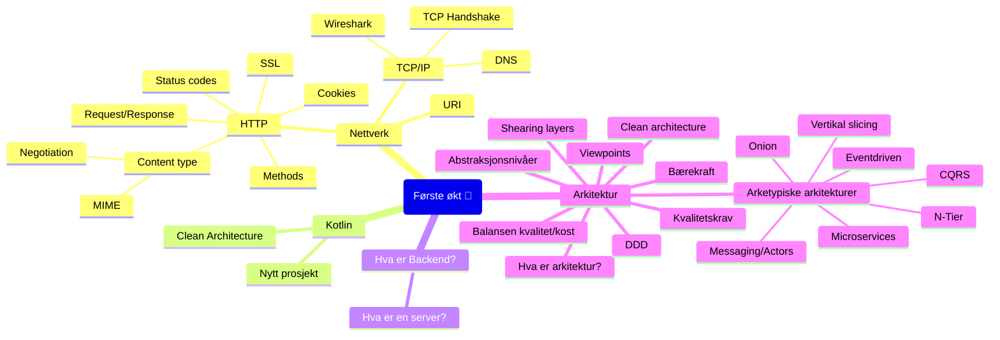

# Oppdrift Backend første økt

Nettverk og arkitektur

## Øvelser

- [Node-øvelser](./node-%C3%B8velser.md)
- [couchdb](..%2Fdel_1%2Fcouchdb)
- [Nytt prosjekt](./nytt-prosjekt.md)
- [Arkitektur-workshop](https://github.com/oddsund/clean-architecture)

## Ressurser

[Innhold](./Innhold.md)

---

