# Oppdrift Backend første økt

Nettverk og arkitektur

## Øvelser

- [Node-øvelser](./node-%C3%B8velser.md)
- [couchdb](..%2Fdel_1%2Fcouchdb)
- [Nytt prosjekt](./nytt-prosjekt.md)
- [Arkitektur-workshop](https://github.com/oddsund/clean-architecture)

## Ressurser

[Innhold](./Innhold.md)

### HTTP-klienter

Noen verktøy for å teste API-er og kalle http-endepunkt.

- [Bruno](https://www.usebruno.com/)
- [RapidAPI](https://paw.cloud/)
- [Insomnia](https://app.insomnia.rest/)
- [Curl](https://curl.se/docs/manpage.html)
- [httpie](https://httpie.io/)
- [IntelliJ](https://www.jetbrains.com/help/idea/http-client-in-product-code-editor.html)
- [VsCode](https://marketplace.visualstudio.com/items?itemName=humao.rest-client)
- [Postman](https://www.postman.com/)

---

```mermaid
mindmap
  root(Første økt 🧭)
    Nettverk
        URI
        HTTP
            Request/Response
            Methods
            Status codes
            Content type
                Negotiation
                MIME
            Cookies
            SSL
        TCP/IP
            Wireshark
            DNS
            TCP Handshake
    Kotlin
        Nytt prosjekt
        Clean Architecture
    Hva er Backend?
        Hva er en server?
    Arkitektur
        Hva er arkitektur?
        Shearing layers
        Abstraksjonsnivåer
        Viewpoints
        Balansen kvalitet/kost 
        Kvalitetskrav
        Bærekraft
        DDD
        Arketypiske arkitekturer
            N-Tier
            Vertikal slicing
            Microservices
            CQRS
            Eventdriven
            Messaging/Actors
            Onion
        Clean architecture
        
```

