# Oppdrift Backend første økt

Nettverk og arkitektur

## Øvelser

- [Node-øvelser](./node-%C3%B8velser.md)
- [couchdb](..%2Fdel_1%2Fcouchdb)
- [Nytt prosjekt](./nytt-prosjekt.md)
- [Arkitektur-workshop](https://github.com/oddsund/clean-architecture)

## Ressurser

### HTTP-klienter

Noen verktøy for å teste API-er og kalle http-endepunkt.

- [Bruno](https://www.usebruno.com/)
- [RapidAPI](https://paw.cloud/)
- [Insomnia](https://app.insomnia.rest/)
- [Curl](https://curl.se/docs/manpage.html)
- [httpie](https://httpie.io/)
- [IntelliJ](https://www.jetbrains.com/help/idea/http-client-in-product-code-editor.html)
- [VsCode](https://marketplace.visualstudio.com/items?itemName=humao.rest-client)
- [Postman](https://www.postman.com/)

### HTTP

- [Historikk](https://developer.mozilla.org/en-US/docs/Web/HTTP/Basics_of_HTTP/Evolution_of_HTTP)

### Uri

- [Syntax](https://en.wikipedia.org/wiki/Uniform_Resource_Identifier#Syntax)
- [RFC 3986](https://www.rfc-editor.org/rfc/rfc3986), ([Om bruk av URI foran URN og URL](https://datatracker.ietf.org/doc/html/rfc3986#page-7))
- [URL](https://url.spec.whatwg.org/)
- [RFC 3987 (IRI)](https://www.rfc-editor.org/rfc/rfc3987)

### Request/Response

- https://developer.mozilla.org/en-US/docs/Web/HTTP/Overview

### Method

- https://developer.mozilla.org/en-US/docs/Web/HTTP/Methods
- https://httpwg.org/specs/rfc9110.html#rfc.section.9.3
- [QUERY](https://www.w3.org/2012/ldp/wiki/Proposal_for_HTTP_QUERY_Verb)

### Response status codes

- https://developer.mozilla.org/en-US/docs/Web/HTTP/Status
- [RFC 2324 🫖](https://www.rfc-editor.org/rfc/rfc2324)

### Content-type

MIME = Multipurpose Internet Mail Extensions

- https://developer.mozilla.org/en-US/docs/Web/HTTP/Content_negotiation
- https://developer.mozilla.org/en-US/docs/Web/HTTP/Basics_of_HTTP/MIME_types

### Cookies

- https://developer.mozilla.org/en-US/docs/Web/HTTP/Cookies

### Annet

To enable CSP, you need to configure your web server to return the `Content-Security-Policy` HTTP header. 
(Sometimes you may see mentions of the `X-Content-Security-Policy` header, but that's an older version and you don't need to specify it anymore.)
Alternatively, the `<meta>` element can be used to configure a policy.

- [CSP](https://developer.mozilla.org/en-US/docs/Web/HTTP/CSP)
- [CORS](https://developer.mozilla.org/en-US/docs/Web/HTTP/CORS)
- [HTTPS](https://developer.mozilla.org/en-US/docs/Glossary/HTTPS)
- [How SSL works](https://www.tutorialsteacher.com/https/how-ssl-works)

Her er en som bruker Accept header fra klient for å bestemme om server skal returnere rik HTML eller plain CSV, for samme lenke;

- [How does it know I want csv? — An HTTP trick](https://csvbase.com/blog/2)

### TCP/IP

- _UDP_: User Datagram Protocol 
- _HTTP_: Hypertext Transfer Protocol
- _DNS_: Domain Name System
- _FTP_: File transfer Protocol
- _DHCP_: Dynamic Host Configuration Protocol
- _SMTP_: Simple Mail Transfer Protocol
- _TLS_: Transport layer Security
- _QUIC_: Quick UDP Internet Connections
- _TCP_: Transmission Control Protocol
- _NAT_: Network Address Translation
- _ICMP_: Internet Control Message Protocol
- _RIP_: Routing Information Protocol
- _BGP_: Border Gateway Protocol
- _ARP_: Address Resolution Protocol

TCP gikk i produksjon første gang i januar 1983.

### DNS

Hostfil: 🍏`/etc/hosts` 🪟`C:\Windows\System32\drivers\etc\hosts`

### Arkitektur

- [Shearing layers](https://en.wikipedia.org/wiki/Shearing_layers)
- [C4](https://c4model.com/)
- [4+1 architectural view](https://en.wikipedia.org/wiki/4%2B1_architectural_view_model)

### Kompleksitet

- [Big ball of Mud](http://www.laputan.org/mud/mud.html#BigBallOfMud)
- https://martinfowler.com/articles/is-quality-worth-cost.html

### Kvalitetskrav

Også kalt «ikke-funksjonelle krav»

### Bærekraft
 - [Digitale utslipp og bærekraftig utvikling](https://blogg.bekk.no/digitale-utslipp-og-b%C3%A6rekraftig-utvikling-68a3ea61b93a)
 - [World Wide Waste](https://gerrymcgovern.com/world-wide-waste/)
 - [Reduce the carbon emissions of your website](https://climateaction.tech/actions/reduce-the-carbon-emissions-of-your-website/)
 - [How Green Is Your Software?](https://hbr.org/2020/09/how-green-is-your-software)

### Domain Driven Design (DDD)

- https://en.wikipedia.org/wiki/Domain-driven_design

### Arkitechture Patterns

- [N-Tier (Microsoft)](https://learn.microsoft.com/en-us/azure/architecture/guide/architecture-styles/n-tier)
- [N-Tier (Wikipedia)](https://en.wikipedia.org/wiki/Multitier_architecture)
- https://en.wikipedia.org/wiki/Hexagonal_architecture_(software)
- [API-First](https://www.nginx.com/resources/glossary/api-first/)
- [Headless](https://en.wikipedia.org/wiki/Headless_software)
- [PBC (Packaged Business Capabilities)](https://www.elasticpath.com/blog/what-are-packaged-business-capablities)
---

```mermaid
mindmap
  root(Første økt 🧭)
    Nettverk
        URI
        HTTP
            Request/Response
            Methods
            Status codes
            Content type
                Negotiation
                MIME
            Cookies
            SSL
        TCP/IP
            Wireshark
            DNS
            TCP Handshake
    Kotlin
        Nytt prosjekt
        Clean Architecture
    Hva er Backend?
        Hva er en server?
    Arkitektur
        Hva er arkitektur?
        Shearing layers
        Abstraksjonsnivåer
        Viewpoints
        Balansen kvalitet/kost 
        Kvalitetskrav
        Bærekraft
        DDD
        Arketypiske arkitekturer
            N-Tier
            Vertikal slicing
            Microservices
            CQRS
            Eventdriven
            Messaging/Actors
            Onion
        Clean architecture
        
```

