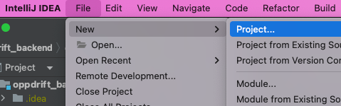
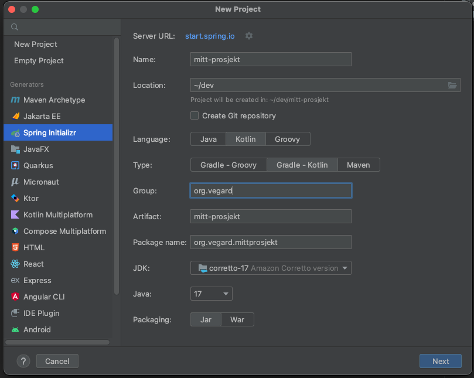
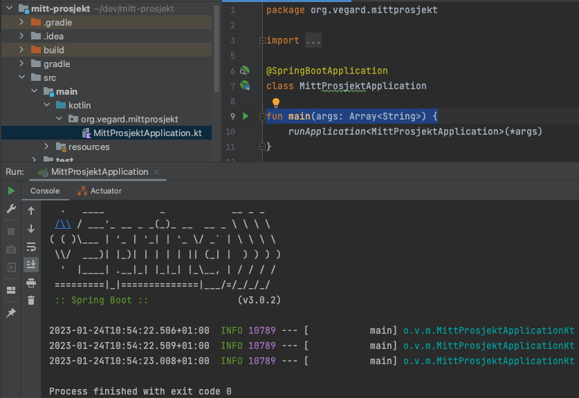

# Endepunkt


> [!NOTE]
> Hensikten med denne øvelsen er å bli kjent med IntelliJ og Spring Boot ved å lage en enkel web-løsning.
> Om du er kjent med IntelliJ og Spring Boot fra før, vil dette være veldig enkelt 😁.

Vi skal lage en løsning fra scratch! Vi kommer til å bruke **Spring Boot** sin wizard (Spring Initializr)
som man finner i Intellij for å opprette et Spring Boot prosjekt.

## Oppsett

Start med å opprette et nytt prosjekt ved å velge `File -> New -> Project..`



Deretter velg Spring Initializr. Her er det viktig at du velger:

```
Language: Kotlin
Type: Gradle - Kotlin.
```




Klikk igjennom steg-viseren. På neste steg kan man legge til forskjellige avhengigheter til Spring.
Vi kommer til å legge til de vi trenger manuelt senere. 

Det kan ta litt tid for Gradle å laste ned
alle pakkene, men når Intellij og Gradle er ferdige med å laste ned og bygge prosjektet ønsker vi
å kjøre opp løsningen. Det gjør vi ved å gå til Kotlin-fila i mappa `main/kotlin/<package name>` 
og trykker på den grønne pila.



Hvis du får ca samme output som det over så har vi en kjørende Spring Boot applikasjon. 
Den gjør ingenting enda, så la oss legge til litt greier.


## La oss legge til ting!

For at applikasjonen vår skal gjøre noe som helst må vi legge til noen avhengigheter.
Legg til avhengigheten `spring-boot-starter-web` som gir oss mulighenten til å definere REST-endepunkt.

For å legge til nye pakker/avhengigheter i prosjektet gå til `build.gradle.kts` og legg til starter-web pakka
under dependencies:

```kotlin
dependencies {
    implementation("org.springframework.boot:spring-boot-starter")
    implementation("org.springframework.boot:spring-boot-starter-web")
    ...
}
```

## Endepunkt

Åpen Kotlin-fila som inneholder main metoden og lag et endepunkt! 
Dette gjør vi ved å legge til en klasse med en annotasjon:


```kotlin
...
fun main(args: Array<String>) {
    runApplication<MittProsjektApplication>(*args)
}

@RestController
class UserController {

    @GetMapping("user")
    fun user() = "Vegard"
}
```

Standardporten til Spring-boot er 8080. Gå til http://localhost:8080/user for å nå endepunktet.


## Scheduler

Videre kan vi legge til en schedulerer som kjører en jobb. Vi kan fortsette i samme Kotlin-fil, 
eller lage en ny fil med koden under:

```kotlin
...
@Configuration
@EnableScheduling
class JobConfig {

    @Scheduled(fixedDelay = 2000, initialDelay = 500)
    fun letsGo() {
        println("Hei")
    }
}

```

## Videre arbeid

### Send tilbake et objekt som JSON fra REST-endepunktet
I steden for å returnere en `String` i endepunktet `user()` prøv å bruk en `data class` for å returnere JSON.

```kotlin
data class User(val name: String, val age: Int)
```


### Lag en HashMap "database" som holder på state

Lag et mutableMap som kan holde på state. 

```kotlin
val savedData: MutableMap<String, String> = mutableMapOf()
```

Bruk `savedData` for å lagre informasjon mellom kall mot et endepunkt. Noen forslag til hva som kan lages:

- En hitcounter
- En måte å lagre og hente meldinger på


<details>
  <summary>Eksempel på endepunkt med request param</summary>
  <p>

```kotlin
// http://localhost:8080/api/foo?id=hallo
@GetMapping("/api/foo")
@ResponseBody
fun getFoo(@RequestParam id: String) = "ID: $id"
```

  </p>
</details>


### Lage en state-machine som scheduleren oppdaterer underveis


Bruk kode eksempelet for `@Schedueled`, kombiner det med en global state (f.eks MutableMap) og bruk en state-machine for å holde og endre på state.

<details>
  <summary>Eksempel kode for en enkel state-machine</summary>
  <p>


```kotlin
data class GameState(
    val isSeeingEnemy: Boolean = false,
    val isEnemyStrong: Boolean = false,
)

sealed class GhostState {

    object Wander : GhostState()
    object Chase : GhostState()
    object Run : GhostState()

    fun nextState(state: GameState): GhostState =
        when (this) {
            Chase -> {
                if (state.isEnemyStrong && state.isSeeingEnemy) Run
                else if (!state.isSeeingEnemy) Wander
                else Chase
            }

            Run -> {
                if (!state.isEnemyStrong && state.isSeeingEnemy) Chase
                else if (!state.isSeeingEnemy) Wander
                else Run
            }

            Wander -> {
                if (state.isSeeingEnemy && state.isEnemyStrong) Run
                else if (state.isSeeingEnemy) Chase
                else Wander
            }
        }
}

fun main() {
    val gameState = GameState(isSeeingEnemy = true, isEnemyStrong = true)
    val state = GhostState.Wander.nextState(gameState)
    println(state)
}
```
</p>
</details>

### Bruk et eksternt API

Vi kan også kalle på eksterne API ved hjelp av Spring. Under er et kodeeksempel på å hente ut pokemons fra pokeAPI. 
Kombiner denne koden med det som er gjort tidligere og tilgjengeliggjør et egent endepunkt som vi kan nå på f.eks `localhost:8080/poke/{pokemon}`.

```kotlin
import org.springframework.web.client.RestTemplate
import com.fasterxml.jackson.annotation.JsonIgnoreProperties
 
@JsonIgnoreProperties(ignoreUnknown = true)
data class Pokemon(var id: Int, val height: Int, val weight: Int)
 
fun main (args : Array){
    val pokemon = RestTemplate()
        .getForObject("https://pokeapi.co/api/v2/pokemon/ditto", Pokemon::class.java)
    
    println(pokemon)
}
```