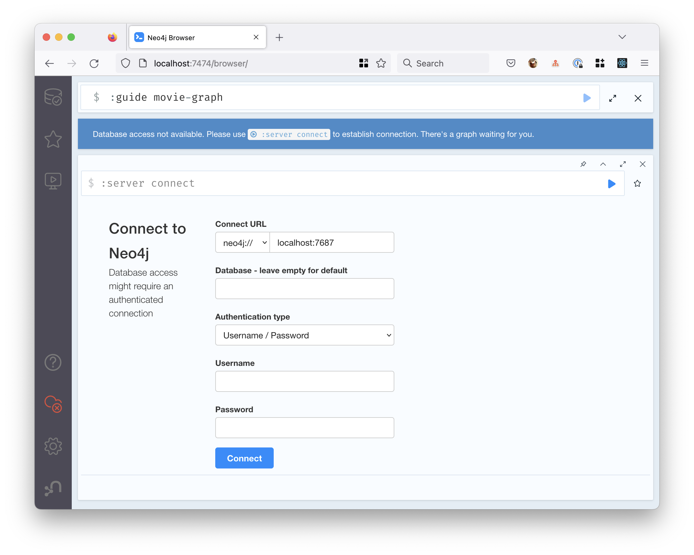
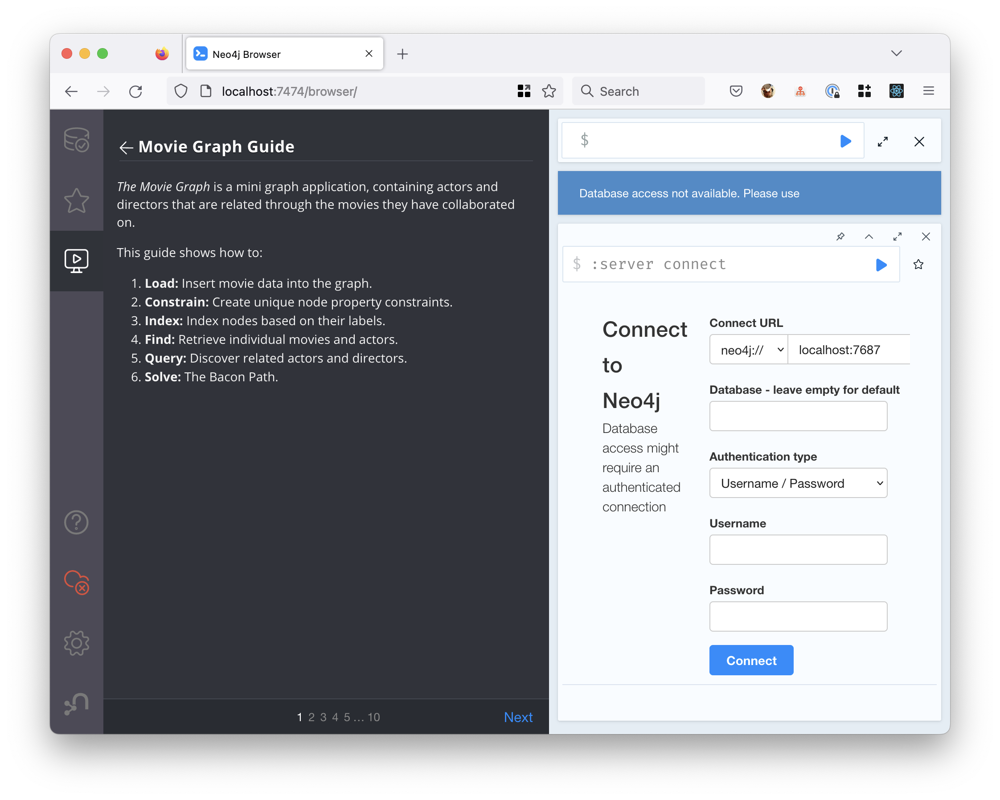

# Grafdatabaseworkshop

Grafdatabaser baserer seg på grafteori (i motsetning til set-teori),
og er optimalisert for å lagre og finne informasjon om noder og 
forbindelser mellom dem.


Noder og forbindelser kan ha egenskaper. En forbindelse har en retning mellom to noder.

## Neo4j Movie Graph Guide

[Neo4J](https://neo4j.com/) er et eksempel på en grafdatabase.
For å gjøre spørringer brukes språket [Cypher](https://en.wikipedia.org/wiki/Cypher_(query_language)).

En enkel innføring i grafspørringer er inkludert i 
[neo4js offisielle image](https://hub.docker.com/_/neo4j).

Start containeren med

```console
docker run \
    --publish=7474:7474 --publish=7687:7687 \
    --env=NEO4J_AUTH=none \
    --name=neo4j_workshop \
    -d \
    neo4j
```

Gå til http://localhost:7474/browser/ for å jobbe med databasen.



Velg *Authentication type* "No authentication" og klikk *Connect*.

Etter at du har startet opp og «logget inn»
Kan du skrive `:guide movie-graph` og trykke enter eller klikke play-knappen til høyre.


Det vil åpne en veiviser for å opprette en database og gjøre spørringer i den.

Følg instruksjonene i hvert steg og klikk _Next_ nederst til høyre.



Når du er ferdig med øvelsen, kan du stoppe containeren igjen:

```console
docker stop neo4j_workshop
```

---

[Eksempel på neo4j i Kotlin](https://github.com/erictsangx/kotlin-neo4j)