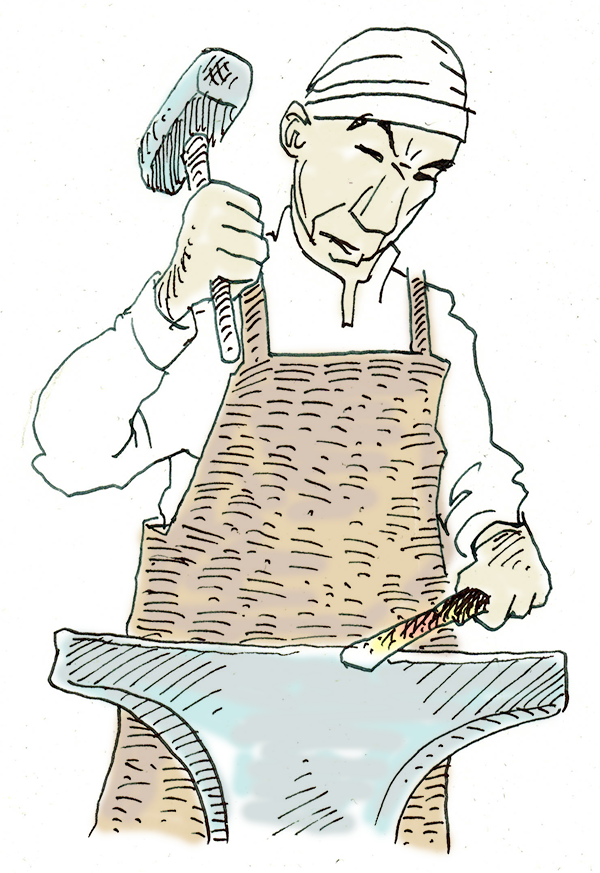
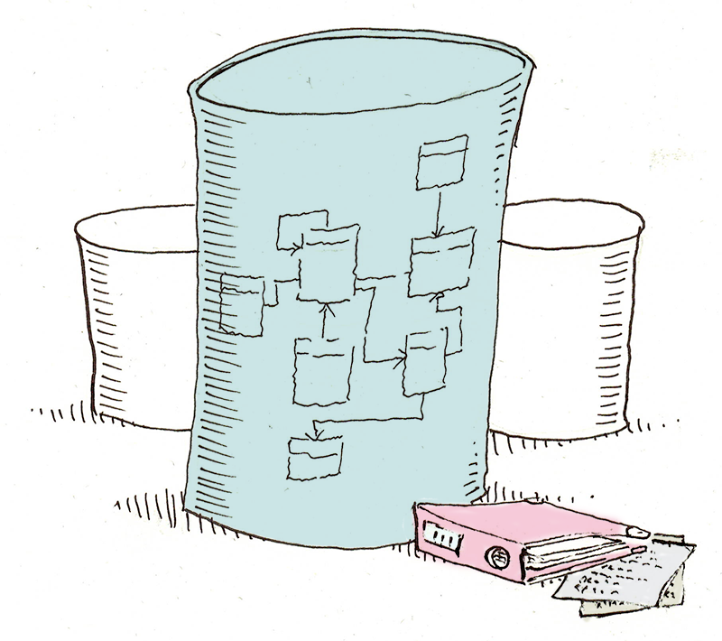
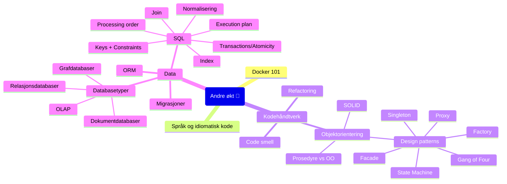

# Program for Oppdrift Backend andre økt

Innholdet i denne økten består i hovedak av to deler; Kodekvalitet og data.

## Docker

Containerfunksjonalitet bruker funksjonalitet i Linux for å isolere prosesser,
så de kan kjøre som ordinære programmer, uten at prosessen har tilgang til resten
av operativsystemet eller filsystemet. Den bruker funksjonene [Control Groups](https://access.redhat.com/documentation/en-us/red_hat_enterprise_linux/6/html/resource_management_guide/ch01)
og [systemd](https://en.wikipedia.org/wiki/Systemd) for å sette opp og kontrollere
ressursbruken for containere. Hver container får i utgangspunktet mountet en mappe
som den ser som roten i sitt filsystem.

Et image beskriver en container ved å ta utgangspunkt i et annet image og legge på et lag med
konfigurasjon, kode og filer. På den måten kan et image være mange lag av konfigurasjoner
fra et base-image (som typisk er en standard distro) til et mer spesifikt image.

Dette fungerer fordi den eneste avhengigheten er på Linux kernel, som er felles for
alle Linux-distribusjoner.

På Mac og Windows må man kjøre Linux i en virtuell maskin for å kunne kjøre opp
Linux-baserte docker-image.

- [What is a Linux container](https://www.redhat.com/en/topics/containers/whats-a-linux-container)
- [Windows server containers (som må kjøre i Windows)](https://learn.microsoft.com/en-us/virtualization/windowscontainers/quick-start/set-up-environment)
- [Jukselapp](./Docker_Jukselapp.md)

```console
docker run --rm hello-world
```

## Kodekvalitet



Programmering er en kombinasjon av ingeniørkunst, kreativitet og håndverk.
I denne delen drøfter vi det som mest minner om håndverk – noen verktøy
som kan hjelpe oss å skrive solid kode.

### Programmeringsspråk

I oversikter over programmeringsspråk viser det seg at de imperative språkene
holder stand på backend-området. Selv om funksjonelle språk er i vekst, så er 
[OO-prinsipper](https://en.wikipedia.org/wiki/Object-oriented_programming) 
fortsatt verdt å lære seg.

Ulike språk har ulike patterns og prinsipper. Det er vanligvis en god idé å følge disse.
Det vil si at man bør kode *idiomatisk*.

- https://octoverse.github.com/2022/top-programming-languages
- [Jetbrains: The state of developer Ecosystem 2022](https://www.jetbrains.com/lp/devecosystem-2022/)
- [Kombinere funksjonell og imperativ kode](https://www.destroyallsoftware.com/screencasts/catalog/functional-core-imperative-shell)
- [Idiomatisk](https://ordbokene.no/bm,nn/search?q=idiomatisk&scope=ei)

### Funksjonelle prinsipper

Om man koder i funksjonelle språk, er det helt andre prinsipper som gjelder enn i 
objekt-orienterte språk. Det er andre patterns, og andre måter å tenke på.

Noen byggestener i funksjonell programmering er:

- **Pure functions**: Funksjoner har ingen sideeffekter. Funksjonen gir samme resultat gitt samme argumenter hver gang.
- **Higher order functions**: Funksjoner har funksjoner som parametre eller returverdi. 
  Det åpner for å bygge sammen funksjoner (*composition*) til nye funksjoner.
- **Immutability**: Språket garanterer at verdier aldri kan endres.
- **Messaging**: I noen språk brukes meldinger til å kommunisere mellom komponenter, i stedet for en direkte kobling.
- **Pattern matching**: Funksjon for å sjekke symboler mot mønster utgjør en sentral komponent i funksjonelle språk, 
  og erstatter i mange tilfelle annen branching som `if` og `switch`.
- **Recursion**: Rekursive kall (at en funksjon kaller seg selv) er optimalisert i funksjonelle språk. 
  Det vil si at et rekursivt kall ikke nødvendigvis fører til at stacken utvides.
  Dette kalles [tail-call optimization](https://en.wikipedia.org/wiki/Tail_call). 

Mange objektorienterte språk som C# oh Java har adobtert noen av disse prinsippene,
slik at man bruke noen av dem også i disse språkene. 

### Code smell

Prinsippet om at kode «lukter», vil vanligvis si at det er små brudd på hva man anser å være
*good practice* (etablerte prinsipper). 

Det finnes verktøy for å finne slike i koden,
og det kan automatiseres; enten som linters eller som byggesteg.
Det viser seg allikevel ofte som vanskelig å ha dette som absolutte regler,
siden avgjørelsene man må ta i programmeringen ofte må ta 
mange hensyn ([It depends](https://convincedcoder.com/2018/08/31/It-depends/)). 

- [Smells](https://refactoring.guru/refactoring/smells)
- [Cyclomatic complexity](https://en.wikipedia.org/wiki/Cyclomatic_complexity)
- [Five lines of code principle](https://dev.to/kanani_nirav/the-five-lines-of-code-principle-why-less-is-more-in-programming-31j6)
- [Poltergeist](https://en.wikipedia.org/wiki/Poltergeist_(computer_programming))

### Refactoring

I [statisk typede språk](https://en.wikipedia.org/wiki/Type_system#Static_typing) 
har vi gode verktøy tilgjengelig til å endre koden.
*Refaktorering* vil si å endre koden **uten å endre oppførsel på koden**.

Det er en god idé å lære seg refaktreringsmulighetene i det verktøyet man bruker.

- Hurtigtast i IntelliJ: `^T`
- [Teknikker](https://refactoring.guru/refactoring/techniques)

### Hva er et objekt?

Et objekt er som en celle. 
Med ett indre, en veldefinert  grense mot utsiden, og på utsiden er resten av verden den interagerer med. 
Membranen er apiet mot omverden. Objektene er livet i applikasjonen.

### Objektorientering

[Objektorientering](https://en.wikipedia.org/wiki/Object-oriented_programming) 
overtok [strukturert programmering](https://en.wikipedia.org/wiki/Structured_programming) 
som ledende prinsipp på 80–tallet.

Kort fortalt handler det om å modellere koden som objekter, deres egenskaper og hvordan de
interagerer med hverandre.

Noen sentrale byggestener i objekt-orienterte språk:

- **Abstraction**: Abstraksjon skjer på flere plan. En viktig mekanisme er at objekter
  kan representeres på ulike abstraksjonsnivå.
- **Encapsulation**: Vi kan skille mellom et objekts interne abstraksjon (som er skjult)
  og dets eksterne api (som er offentlig).
- **Polymorphism**: Dette er prinsippet at et symbol kan representere ulike typer.
- **Inheritance**: Typer arver av hverandre, så en klasse kan overta egenskaper fra en subtype.
  Denne mekanismen har vist seg å være mindre nyttig, og brukes i noe mindre grad, siden
  det introduserer en sterk kobling mellom foreldre og barn som kan være uønsket.

I bruken av språket er det noen prinsipper som går igjen:

- **[DRY](https://en.wikipedia.org/wiki/Don%27t_repeat_yourself)/Gjenbruk**: 
  Vi forsøker å identifisere duplisert kode og funksjonalitet og slå det sammen til en instans
  som kan refereres flere steder.
  Det har vist seg at også dette introduserer koblinger, så det er ikke en absolutt regel.
- **Abstrakson og innkapsling**: Dette er prinsipper som normalt sett reduserer kobling, 
  selv om det kan øke kompleksitet. Det er vanligvis et godt bytte.
- **Ortoganilitet/kobling**: Ortogonalitet er et begrep hentet fra geometrien, og beskriver
  objekter som er helt uavhengig av hverandre. Det vil si at de ikke er koblet til hverandre.
  Det vil si at en endring i den ene, aldri vil kreve forandring i den andre.

### Procedural vs Object-Oriented

*Procedural* (prosedyre) kommer fra «Structured Programming». Det er kode som har fokus 
på variabler, datastrukturer, subrutiner og algoritmer. Koden er modellert som en 
oppskrift eller manus som beskriver en løsning.

*Objektorientering* modellerer løsningen ved hjelp av objekter, metoder og tilstander.

### SOLID

Robert Martin («Uncle Bob») har beskrevet fem prinsipper for objektorientert kode.
De danner sammen akronymet «SOLID».

- [Whitepaper](https://web.archive.org/web/20150906155800/http://www.objectmentor.com/resources/articles/Principles_and_Patterns.pdf)
- [S.O.L.I.D The first 5 principles of Object Oriented Design with JavaScript](https://medium.com/@cramirez92/s-o-l-i-d-the-first-5-priciples-of-object-oriented-design-with-javascript-790f6ac9b9fa)
- [Clean Code 📖](https://www.amazon.com/Clean-Code-Handbook-Software-Craftsmanship/dp/0132350882)
- [Eksempelkode](https://bit.ly/solid_code)

#### Single Responsibility principle

Kort fortalt: En klasse (eller metode) skal bare ha én oppgave.

- [Wikipedia](https://en.wikipedia.org/wiki/Single-responsibility_principle)
- [Eksempel](https://stackoverflow.com/questions/10620022/what-is-an-example-of-the-single-responsibility-principle)

#### Open-Closed principle

Prinsippet er at en type skal utvides gjennom arv eller polymorfisme.
En utvidelse av funksjonaliteten i en klasse skal ikke påvirke konsumentene av den.

- [Wikipedia](https://en.wikipedia.org/wiki/Open%E2%80%93closed_principle)
- [Eksempel](http://joelabrahamsson.com/a-simple-example-of-the-openclosed-principle/)

#### Liskov Substitution principle

Konsumenter av en baseklasse må også kunne bruke objekter som avleder/arver av denne klassen
uten å vite om det.

- [Wikipedia](https://en.wikipedia.org/wiki/Liskov_substitution_principle)
- [Eksempel](https://dzone.com/articles/the-liskov-substitution-principle-with-examples)

#### Interface Segregation principle

En type skal bare eksponere de metodene som er nødvendig. Konsumenter skal bare være
avhengig av egenskaper og metoder den faktisk bruker.

- [Wikipedia](https://en.wikipedia.org/wiki/Interface_segregation_principle)

#### Dependency Inversion principle

Høynivå-moduler skal ikke være direkte avhengig av lavnivå-moduler. Begge bør ha
avhengighet til abstraksjoner (interfaces).

Dependency-injection rammeverk (også kalt «inversion-of-control») bygger på dette prinsippet.

- [Wikipedia](https://en.wikipedia.org/wiki/Dependency_inversion_principle)

## Design Patterns

- [Wikipedia](https://en.wikipedia.org/wiki/Design_pattern)

### Hva er design patterns?

Dette begrepet er (som så mye annet) hentet fra det virkelige arkitekturfaget.
Det ble introdusert av Christopher Alexander i boka *[A pattern Language](https://en.wikipedia.org/wiki/A_Pattern_Language)*.
Det kan beskrives som maler for problemløsing. Kjente problemer er løst og beskrevet og navngitt.
Det kan gi oss et språk for å beskrive løsninger på problemer, og koden som implementerer det.

### Ulike språk og programmeringsstiler har ulike patterns

Funksjonelle språk har andre patterns enn imperative eller deklarative språk.
Dynamiske språk åpner for teknikker som ikke er tilgjengelig i statisk typede språk.
Det er fornuftig å bruke idiomer fra det språket man skriver i, og ikke forsøke å tvinge
(for eksmepel) OO-prinsipper inn i et rent funksjonelt språk.

### Gang of Four

I 1994 kom boka *Design Patterns* ut. Den hadde fire forfattere
(Gamma, Helm, Johnson og Vlissides), og blir derfor ofte referert til som Gang og four (GOF).

Det er en katalog over kjente design patterns, katalogisert og grundig beskrevet.

Den er delt i tre deler:

- Creational Patterns (Factory, Singleton, Prototype)
- Structural Patterns (Adapter, Decorator, Facade, Flyweight, Proxy)
- Behavioral Patterns (Command, Chain of Responsibility, Iterator, Mediator, Memento, Observer, Strategy, Visitor)

Løsningene som er beskrvet har blitt en slags bransjestandard, og begrepene har festet seg 
som kanoniske. En del patterns er nå bygget inn i moderne programmeringsspråk.

- [ISBN 0201633612](https://www.bokkilden.no/enkeltSok.do?enkeltsok=ISBN+0201633612&rom=MP)
- [Wikipedia](https://en.wikipedia.org/wiki/Design_Patterns)

### Façade

En *fasade* er en klasse (eller modul) som danner et forenklet eller konsistent api til 
et subsystem. Det gjør det enklere å bruke subsystemet, ved at implementasjonsdetaljer
og kompleksitet skjules.

- [Facade](https://refactoring.guru/design-patterns/facade)

### Factory method

Dette er en metode som har som oppgave å opprette nye objekter av en gitt type.
Dette kan være nyttig for å skjule ting som avhengigheter, forretningsregler, caching/pooling og lignende.

- [Factory Method](https://refactoring.guru/design-patterns/factory-method)

### Abstract factory

På lignende vis som for *facotory method* handler dette om å fjerne koblingen til
oppretting av objekter fra konsumentene av dem. Her er det en abstrakt type som definerer
en fabrikk. Konkrete implementasjoner kan ha ulike regler eller subtyper de kan opprette.

- [Abstract Factory](https://refactoring.guru/design-patterns/abstract-factory)

### Singleton

Dette er et pattern som garanterer at det bare finnes én instans av en gitt type.

Dette patternet har siden blitt sett på som et anti-pattern. Fordi det bruker en 
skjult konstruktør og statiske felt, er det vanskelig å teste en singleton i enhetstester.

Det er vanlig å oppnå samme effekt (én instans av en type) ved å bruke dependency-injection.

### Proxy

En proxy er et objekt som representerer et annet objet (typisk ved å implementere samme
interface). Det kan være nyttig ved lazy-loading, caching o.a.

### Decorator

En *decorator* er et objekt som kan utvide en annen komponent.
Det pakker inn et annet objekt og implementer samme interface. Så kan den «kapre» metodekallene,
legge til ekstra funskjonalitet før kallet sendes videre til den indre komponenten.

### Strategy

Dette handler om at en gitt algoritme kan erstattes med en annen, styrt av konfigurasjon eller annen logikk.

### Iterator

Dette er en kontrakt for objekter som kan itereres over
(som arrays, lister, sett etc). I stedet for å gi konsumenten tilgang til hele samlingen 
det skal itereres over, eksponeres bare to metoder:

- **hasnext()**: denne er sann om det finnes flere elementer å iterer over
- **next()**: returnerer det neste elementet.

Dette åpner for at en samling med elementer kan konsumeres mer som en stream. Det igjen
åpner for lazy loading og delvis henting over et nettverk f.eks. Det muligjør også 
uendelig store samlinger.

Dette patternet er blitt innebygget i en rekke språk, siden det ble oppdaget.

### Observer

Når to eller flere objekter er avhengig av å synkroniseres på bakgrunn av en felles
state, kan det være uheldig å la de kjenne til hverandre direkte. Det skaper en unødvendig 
kobling mellom dem.

I stedet flyttes koordineringsansvaret til et annet objekt. Det kalles når state
endrer seg. Tanken er at *observer* er et abstrakt interface, som skjuler den direkte
avhengigheten.

### Command

Tanken her er å modellere handlinger som objekter. De har en metode for å utføre
handlingen. Det åpner for å også implementere angre (undo), om man lagrer en stack med alle
valgte handlinger.

### Dependency Injection

*Dependency Injection* (DI) eller *Inversion of Control* (IoC) er et pattern der alle
avhengigheter mellom konkrete klasser hånteres av en modul («DI container»).
All opprettelse av nye objekter håndteres av den, og den tar også av seg resten av
livssyklusen til objektet.

- [Dependency Injection](https://en.wikipedia.org/wiki/Dependency_injection)

### State Machine

Ofte er det sentrale objekter i modellen til en applikasjon som har en mer eller mindre
definert livssyklus. Dette blir ofte løst med statusfelt eller flagg som settes fra
forskjellige steder i løsningen når noe skjer med et objekt.
En konsekvens er at det kan være vanskelig å ha kontroll med hva som forårsaker
state-endringer og hvordan man kan håndheve forretningsregler rundt dette.

Ved å endre modellen fra å sende nye *statuser* til å sende *hendelser*, kan en 
modul håndtere endringer i state, og håndheve hva som skal være lovlig.

- [State Machine](https://en.wikipedia.org/wiki/Finite-state_machine)
- [Eksempel](./StateMachine/)
- [Pacman](https://pacman.ee/)
- [Ghosts](https://villains.fandom.com/wiki/Ghosts_(Pac-Man))

## Data

En kikk på ulike databasetyper.

Databasen er på mange måter hjertet i de fleste applikasjoner.
Datatap er noe vi for en hver pris vil unngå.

Hvordan vi modellerer databasen har stor påvirkning på løsningens ytelse.



### Hensikt

Databaser kan dekke ulike behov:

- Persistens av tilstand i applikasjonen
- Rapportering
- Analyse
- Logging
- Historikk
- …

Ulike databasetyper er mer eller midre egnet for ulike formål.

### Typer

Det finnes et vell av kategorier av databaser, skreddersydd for spesifikke formål.
En måte å dele dem opp på er:

- **Relasjonsdatabaser**: Disse bruker SQL for navigasjon og manipulering av data. De baserer seg på et strikt
  *[skjema](https://en.wikipedia.org/wiki/Database_schema)* for dataene. De garanterer [ACID](https://en.wikipedia.org/wiki/ACID).
  Eksempler: [MySQL](https://www.mysql.com/), [PostgreSQL](https://www.postgresql.org/), 
  [Oracle](https://www.oracle.com/database/), [SQL Server](https://www.microsoft.com/nb-no/sql-server/sql-server-2022).
- **NoSQL-databaser**: Dette er en samlebetegnelse for databaser som er laget for å løse problemene som
  begrensningene i relasjonsdatabaser skaper. Det finnes flere undertyper:
  - **Dokumentdatabaser**: Databaser som lagrer dokumenter (JSON-objekter). De håndhever ikke et skjema,
    slik relasjonsdatabaser gjør.
    Eksempler: [MongoDB](https://www.mongodb.com/), [CouchDB](https://couchdb.apache.org/).
  - **Key-value-store**: Lagrer data som key-value.
    Eksempler: [Redis](https://redis.io/), [DynamoDB](https://aws.amazon.com/dynamodb/).
  - **Wide-column-stores**: Lagrer data i tabeller, rader og dynamiske kolonner. 
    Optimalisert for store datamengder.
    Eksempler: [Cassandra](https://cassandra.apache.org/_/index.html), [HBase](https://hbase.apache.org/).
  - **Grafdatabaser**: Lagrer data med fokus på relasjonene mellom objekter i databasen.
    Optimalisert for å finne relasjoner mellom objekter (i flere ledd).
    Eksempler: [Neo4j](https://neo4j.com/), [ArangoDB](https://arangodb.com/).
- **In-Memory-Database**: Holder data i minne for å unngå forsinkelsen som diskbruk gir.
  Eksempler: [Redis](https://redis.io/), [SAP Hana](https://www.sap.com/products/technology-platform/hana.html)
- **Objektorienterte databaser**: Objekter lagres i databasen på en form som er mer kompatibel med
  hvordan objekter modelleres i OO-programmering.
  Eksempler: [db4o](https://github.com/pegurnee/db4o), [ObjectDB](https://www.objectdb.com/). 
- **NewSQL databases**: Prøver å kombinere skalerbarheten til NoSQL med ACID-garantiene til relasjonsdatabaser.
  Eksempler: [Google Spanner](https://cloud.google.com/spanner/), [CockroachDB](https://www.cockroachlabs.com/docs/stable).
- **Tidsserie-databaser (TSDB)**: Optimalisert for å lagre data som tidsserier. Det vil si, data som er lagret
  på ulike tidspunkt. Egner seg godt til sensordata og lignende.
  Eksempler: [InfluxDB](https://www.influxdata.com/lp/influxdb-database), [TimescaleDB](https://github.com/timescale/timescaledb).
- **Distribuerte databaser**: Dette er databaser som kan være spredt over flere lokasjoner.
  De tilbyr høy tilgjengelighet, feiltoleranse og skalerbarhet.
  Eksempler: [Cassandra](https://cassandra.apache.org/_/index.html), [Couchbase](https://www.couchbase.com/)
- **AI-databaser**: Databaser som er optimalisert for å lagre AI-modeller.
  Eksempler: [MLDB](https://mldb.ai/), [mindsdb](https://mindsdb.com/), [chroma](https://www.trychroma.com/).


- [How many types are there?](https://stackoverflow.com/questions/33760290/how-many-types-of-database-are-there#answer-33787171)
- [Models](https://en.wikipedia.org/wiki/Database#Models)
- [Bekk open databasekurs](https://github.com/bekkopen/databasekurs)

### Grafdatabaser

Der relasjonsdatabaser bruker [sett-teori](https://no.wikipedia.org/wiki/Mengdel%C3%A6re), 
baserer grafdatabasen seg på [grafteori](https://no.wikipedia.org/wiki/Grafteori).
Data lagres som noder og kanter (med egenskaper).
Databasen er optimalisert for å søke i relasjoner på tvers av flere noder (noe 
relasjonsdatabaser kan slite med).

### OLAP

*Online Analytic Processing* er databaser der data er prosessert etter ulike dimensjoner
(kategorier), så det skal være lett å analysere data ut fra disse.
Datamodellen ligner på den du finner i pivottabeller i Excel.

- [Overview](https://support.microsoft.com/en-us/office/overview-of-online-analytical-processing-olap-15d2cdde-f70b-4277-b009-ed732b75fdd6)
- [Wikipedia](https://en.wikipedia.org/wiki/Online_analytical_processing)

### Dokumentdatabaser

Dokumentdatabaser inneholder semistrukturerte data. I utgangspunktet kan data ha hvilken som helst form.
Indeksering brukes for å gjøre uthenting av data med kjent form raskere.

### Relasjonsdatabaser

Relasjonsdatabaser lagrer data i tabeller, der alle radene i en tabell er relaterte data.
De har veldefinerte skjema (schema). Tabellene er normaliserte. Reglene som styrer dette kalles
*constraints*.

SQL brukes til både å definere schema og manipulere data.

- [Normalformer](https://en.wikipedia.org/wiki/Database_normalization#Normal_forms)

### SQL

SQL brukes i all kommunikasjon med databasen. Språket kan deles opp i en Schema-del og en
Data-del.

Språket har mange dialekter; hver databaseleverandør har bygget inn sine særegenheter.
Det er en grunnstandard (*«ANSI SQL»*) som egentlig definerer språket.

- [SQL](https://en.wikipedia.org/wiki/SQL)
- [ANSI SQL](https://blog.ansi.org/sql-standard-iso-iec-9075-2023-ansi-x3-135/)
- [SQL-PD](https://sqlpd.com/)

### Query Processing Order

*Structured Query Language* har en syntax som skal ligne på normal engelsk.
En konsekvens av det er at det ikke prosesseres i samme rekkefølge som det skrives.

Det styrer også hva scope er for variabler og verdier i en spørring.

1. `FROM`
1. `WHERE`
1. `GROUP BY`
1. `HAVING`
1. `SELECT`
   1. `DISTINCT`
   1. `LIMIT`
1. `ORDER BY`

Når man skal skrive en `SELECT` spørring, kan det derfor være lurt å begynne med `FROM`-leddet.

### Keys & Constraints

Alle rader i en tabell må være unike. En vanlig måte å oppnå det på, er ved å ha en
primærnøkkel i en kolonne som har som eneste jobb å være unik. En slik regel kalles
*unique constraint* eller *primary key constraint*.

For å dele opp data i flere tabeller (normalisering) kopieres verdien av primærnøkkelen
i raden man referer til inn i en egen kolonne. For å garantere dataintegritet, kan 
databasen kreve at en primærnøkkel med den verdien finnes i den refererte tabellen.
En slik regel kalles *foreign key constraint*.

I IntelliJ er *Quick Documentation* et nyttig verktøy for å se definisjoner av både
tabeller og constraints.

### Join

`JOIN` er uttrykket som brukes for å skrive spørringer på tvers av to tabeller.
Det er alltid en venstre og en høyre tabell i uttrykket, og hvilken type join
styrer hvilke data man får.

Om man ønsker [snittet](https://no.wikipedia.org/wiki/Snitt_(mengdel%C3%A6re))  (`venstre ∩ høyre`)
brukes en *inner join* (men det holder å skrive `JOIN`).

```SQL
SELECT * 
FROM v
JOIN h ON v.key = h.v_key;
```

Ofte ønsker man å hente alle radene fra venstre tabell, og de radene som matcher i høyre
tabell. Da brukes en *left join*.

```SQL
SELECT * 
FROM v
LEFT JOIN h ON v.key = h.v_key;
```

- [Wikipedia](https://en.wikipedia.org/wiki/Join_(SQL))
- [Visual representation](https://www.codeproject.com/Articles/33052/Visual-Representation-of-SQL-Joins)

### Index

En indeks gjør at oppslag i en tabell går raskere, ved at dataene lagres på en form som gjør
oppslag effektivt.

En *clustered index* definerer rekkefølgen rader i en tabell er lagret i. Det kan derfor bare
være én clustered index per tabell.
En *non-clustered index* er en kopi av noen kolonner fra tabellen (en indeksnøkkel) som er lagret
utenfor tabellen, med en referanse til primærnøkkelen i tabellen den indekserer.
Det kan være mange non-clustered index knyttet til en tabell.

Indekser akn gjøre oppslag i tabellen raskere, men det er avhengig av at det er mange nok rader
til at ikke et vanlig oppslag (en *table scan*) er raskere. En indeks vil også gjøre at skriving
til tabellen går saktere, siden indekser må oppdateres.

Data i en ordinær (non-clustered) indeks er lagret i 
et [B+ tre](https://en.wikipedia.org/wiki/B%2B_tree), 
som gjør oppslag og skriving effektivt [O(log n)].

### Transactions/Atomicity

Relasjonsdatabaser garanterer [ACID](https://en.wikipedia.org/wiki/ACID)
(Atomicity, Consistency, Isolation, Durability).
Dette er garantier som beskytter dataenes integritet. En operasjon vil aldri bli 
delvis gjennomført; den blir enten fullført eller rullet tilbake. Ulike spørringer 
kan ikke påvirke hverandre mens de kjører. Det er ikke mulig å endre data, så databasen 
ender i en tilstand som bryter mot skjemaet i databasen.

*Transaksjoner* er en mekanisme som brukes til å definere et sett med operasjoner som
skal behandles som en atomisk operasjon. Enten blir alle operasjonene fullført, eller
så forblir databasen i den tilstand den var.

En transaksjon starter med `BEGIN TRANSACTION;` og avsluttes med `COMMIT TRANSACTION;`.
Den rulles tilbake ved feil, eller med `ROLLBACK TRANSACTION;`.

Et tips er å begynne å skrive BEGIN og ROLLBACK før du begynner å drodle i SQL-vinduet, 
så er det mindre sjanse for å slette eller endre data ved et uhell.

- [Wikipedia](https://en.wikipedia.org/wiki/Database_transaction)

### Normalisering

Normalisering i SQL er en prosess for å strukturere data for å unngå redundans og
avhengigheter, ved å dele opp data i flere tabeller. Hensikten er mer effektive
spørringer og lettere vedlikehold.

1. **1NF**: Hver rad i en tabell må være unik. Data i hver kolonne må være udelelige verdier.
   Det betyr at kolonner ikke kan inneholde lister eller lignende.
2. **2NF**: I tillegg til *1NF*, må hver kolonne som ikke er nøkkel være avhengig av
   hele primærnøkkelen.
3. **3NF**: I tillegg til *2NF* må alle ikke-nøkkel-kolonnene være uavhengig av hverandre.

- [Wikipedia](https://en.wikipedia.org/wiki/Database_normalization#Normal_forms)

### Execution plan

Hvordan en database faktisk utfører en spørring er avhengig av spørringen selv, men også 
mengden data i tabellene, om det finnes indekser og om databasen har «erfaring» eller
trening med å operere på tabellene. Det kan også være optimalisereinger som at noen av 
dataene ligger i minnet fra en tidligere spørring.

For å se hvordan databasen utfører spørringen, kan man be om å få se *execution plan*
til en spørring. Det er et nyttig verktøy for å optimalisere når spørringer går for sakte.

Planen viser operasjoner som utføres, koblingen mellom dem, kostnad ved hver operasjon
og mengden data ut og inn av dem.

I PostgreSQL kan man skrive `EXPLAIN` før en spørring, som dette:

```sql
EXPLAIN VERBOSE
SELECT
    c.first_name || ' ' || c.last_name AS name,
    COUNT(1) AS count_rental,
    SUM(p.amount) AS amount
FROM rental r
         JOIN customer c ON r.customer_id = c.customer_id
         JOIN payment p ON r.rental_id = p.rental_id
GROUP BY c.first_name, c.last_name
ORDER BY amount;
```

Noen begreper som det er greit å kjenne til:

- **Scan**: Det innebærer å lese en hel tabell eller index. Om tabellen er stor, er dette et tegn på at det mangler en indeks.
- **Seek**: Det betyr at det brukes en indeks for å finne data. Det er vanligvis mye mer effektivt enn en *scan*.
- **Join**: Dette er operasjonen med å slå sammen data fra to tabeller.
  - *Nested loops*: Her itereres det over radene i tabellene (en loop inni en annen loop).
    Dette kan være effektivt om det ikke er for mange rader i de to tabellene.
  - *Hash join*: Databasemotoren bygger opp en hash-tabell av den minste tabellen, og bruker
    den til å slå opp i den større tabellen. Dette er mer effektivt når det er større datamengder.
  - *Merge join*: Sorterer dataene på join-nøkkelen (om de ikke allerede er sortert slik),
    og går gjennom begge tabellene samtidig rad for rad. Det kan være en kostnad med å 
    sortere, men dette er ellers en effektiv metode når det er mye data.
- **Aggregate**: Aggregatfunksjoner som `SUM()`, `COUNT()` osv.
- **Sort**: Sortering av data.

### ORM

ORM står for *Object Relational Mapping* og er en bro mellom datamodellen i en relasjonsdatabase
og objektmodellen i en objektorientert kodebase.
Det er et bibliotek som tilbyr klasser som representerer tabellene i databasen. 
Man kan gjøre operasjoner på klassene, og ORM-en vil generere SQL og kjøre det mot databasen,
samt mappe data mot klassene igjen.

Det abstraherer bort alle detaljer rundt SQL, men kan innføre betydelig kompleksitet som
en konsekvens. Det kan også føre til ytelsesproblemer, om man ikke bruker det riktig.

En abstraksjon mot databasen gjør det også enklere å bytte ut databasen med en annen teknologi,
men i praksis er det sjelden man har behov for det.

- [Wikipedia](https://en.wikipedia.org/wiki/Object%E2%80%93relational_mapping)
- [Hibernate](https://hibernate.org/orm/)

### Migrasjoner

I en applikasjon som bruker en relasjonsdatabase, er det en tett kobling mellom
versjonen av skjemaet i databasen og versjonen av kodebasen. Om databaseskjemaet endres
(fjerne en kolonne, legge til en tabell o.l.) må også koden som bruker databasen endres
*samtidig*. Om dette ikke håndteres automatisk, er det vanskelig å synkronisere og vil
kreve nedetid ved utrulling til produksjon.

Migrasjoner løser dette. Det er kodefiler (vanligvis SQL) som beskriver skjemaendringene.
Disse ligger sammen med den andre koden, og versjoneres sammen med denne.
Ved utrulling, spilles disse av mot databasen og oppdaterer den samtidig som den andre
koden installeres.

En migrasjon kan ha kode for å migrere opp og ned (rulle tilbake). 
Det siste er problematisk, siden det kan være vanskelig å gjøre uten datatap.

---
 


---

[Presentasjon 📽](https://media.githubusercontent.com/media/bekk/oppdrift_backend/main/del_1/Kurspresentasjon_1.pptx)