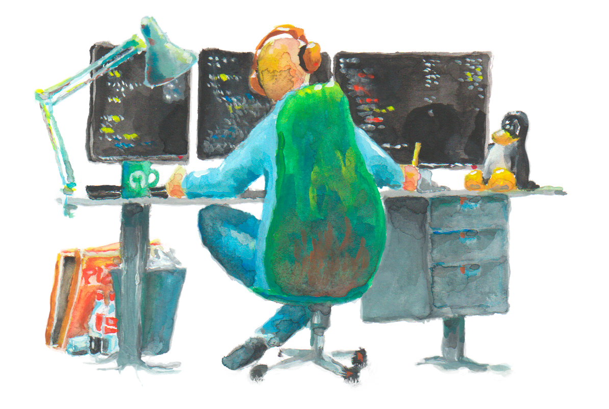
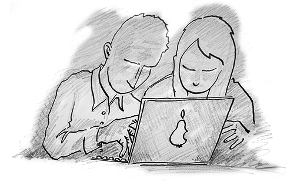
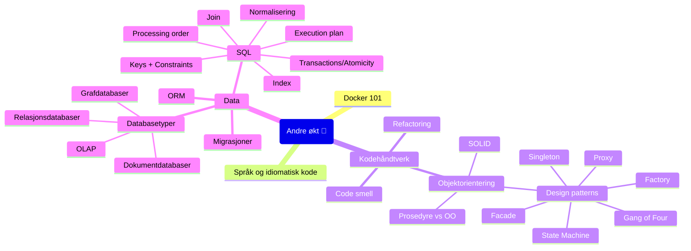

# Oppdrift Backend andre økt

Databaser og patterns

## Øvelser

1. [Debuggern til Intellij](./debugger.md)
1. [Grafdatabaseworkshop](./Grafdatabaseworkshop.md)
1. [Dokumentdatabaseworkshop](./couchdb/Dokumentdatabaseworkshop.md)
1. [SQL-workshop](https://bekk.github.io/oppdrift_backend/sql/oppgaver)
1. [Database integrasjon](./database-integrasjon.md)

## Ressurser

[Docker jukselapp](Docker_Jukselapp.md)

[Innhold](Innhold.md)

---

