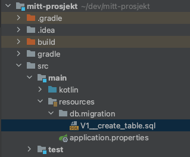

# Del 2 av løsning fra scratch 


> [!NOTE]
> I denne løsningen jobber vi videre med web-løsningen.
> Hensikten er å få en kjørende rest-applikasjon med database for lagring.

Ta utgangspunkt i det som ble gjort i [første del](../del_0/nytt-prosjekt.md) og jobb videre med samme kodebase.
Du kan også åpne den [her](./DatabaseIntegrasjon/backend), om du ikke fikk gjort oppgaven sist.


<details>
  <summary>Klikk for eksempelkode fra del 1</summary>
  <p>

```kotlin
package org.vegard.mittprosjekt

import org.springframework.boot.autoconfigure.SpringBootApplication
import org.springframework.boot.runApplication
import org.springframework.context.annotation.Configuration
import org.springframework.scheduling.annotation.EnableScheduling
import org.springframework.scheduling.annotation.Scheduled
import org.springframework.web.bind.annotation.GetMapping
import org.springframework.web.bind.annotation.RestController

@SpringBootApplication
class MittProsjektApplication

fun main(args: Array<String>) {
    runApplication<MittProsjektApplication>(*args)
}

@RestController
class UserController {

    @GetMapping("hei")
    fun hei() = "hei"
}

@Configuration
@EnableScheduling
class JobConfig {

    @Scheduled(fixedDelay = 2000, initialDelay = 500)
    fun letsGo() {
        println("Hei")
    }
}
```
  </p>
</details>


## Flyway og H2 oppsett

Database! Databaser! Data som lagres! Det er på tide å legge til en database i løsningen vår.

I dette eksemplet bruker vi H2, som er en in-memory database. Og Flyway som er et verktøy for
å holde styr på database migreringer. H2 er en in-memory database og
vil ikke lagre noe i mellom hver gang man kjører applikasjonen. Man har mulighet til å lagre
det som er i databasen til fil mellom hver kjøring, men mer om det senere. La oss legge til avhengighetene vi trenger
for H2 og Flyway.

I `build.gradle.kt` legg til avhengihetene for Flyway og H2:

```kotlin
dependencies {
    implementation("org.springframework.boot:spring-boot-starter")
    implementation("org.springframework.boot:spring-boot-starter-web")
    
    implementation("org.springframework.boot:spring-boot-starter-data-jpa")
    implementation("org.flywaydb:flyway-core:9.8.1")
    runtimeOnly("com.h2database:h2")
    ...
}
```

Etter vi har lagt til pakkene må vi også definere hvordan Spring skal bruke databasen.
Spring Boot kommer med en hel del magi ut av boksen, så alt vi trenger å gjøre
for å få Spring til å snakke med databasen er å definere følgende i `src/main/resources/application.properties`:


```yaml
spring.datasource.url=jdbc:h2:mem:testdb
spring.datasource.driverClassName=org.h2.Driver
spring.datasource.username=sa
spring.datasource.password=password
```

Flyway sine migrasjonfiler har et spesifikt format som sier noe om rekkefølgen 
([les mer om det her](https://flywaydb.org/documentation/concepts/migrations.html#naming)).

Migrasjonsfilene må ligger under `resources/db/migration/<navn>.sql` for at Spring skal plukke de opp
automatisk.



Da gjenstår det bare å opprette en database med noe data. Under er to eksempel-filer:

```sql
--- V1__create_table.sql
CREATE TABLE Users (
    id Int unique,
    title varchar(50),
    username varchar(50)
);
```

```sql
--- V2__insert_users.sql
insert into Users (id, title, username) values (1, 'Konsulent', 'Vegard');
insert into Users (id, title, username) values (2, 'Artist', 'Donny Benet');
```

## Bruk av database i Spring boot

Etter vi har lagt til Flyway og H2 er det nå påtide å bruke denne i løsningen vår.
I endepunktet fra del 1, legg til `DataSource` og bruk denne i endepunktet.
Eksempel-kode under:


```kotlin
@RestController
class UserController(val dataSource: DataSource) {

    @GetMapping("hei")
    fun hei(): List<String> {
        val users = dataSource.connection.use { connection ->
            val sql = "SELECT * FROM Users";
            val resultSet = connection.createStatement().executeQuery(sql)
            val usernames = mutableListOf<String>()
            while (resultSet.next()) {
                usernames.add(resultSet.getString("username"))
            }
            usernames
        }
        return users
    }
}
```

## Lagring av data mellom hver kjøring

H2 kommer med mulighet for å lagre databasen mellom hver kjøring ved å definere en fil.

Oppdater `src/main/resources/application.properties` med følgende for å lagre H2 databasen til fil:

`spring.datasource.url=jdbc:h2:file:./testdb`


## Videre arbeid

Fortsett med oppgavene fra [del 1 - nytt prosjekt](../del_0/nytt-prosjekt.md) og bruk det du har lært om databaser.
