# Debugging og refactoring

## Oppgaver

1. Clone prosjektet: [https://github.com/spring-projects/spring-petclinic](https://github.com/spring-projects/spring-petclinic) og prøv debuggern
2. Klikk på en funksjon og få frem refactormenyen
   1. Endre navn på metoden
   2. Angre (undo) for å rulle tilbake endringen
3. Debug løsningen (f.eks i **Run**-menyen.)
3. Sett et breakpoint i `OwnerController.java` på linje 159 (for eksempel).
4. Kall endepunktet [/owners/3](http://localhost:8080/owners/3) (i en nettleser, i endpoints-vinduet eller på annet vis).
5. Prøv ut funksjonaliteten som er nevnt nedenfor:
   1. Få programmet til å pause på et breakpoint
   2. Naviger med [navigasjonsknapper](#kontrollknapper)
   3. Se på [variabler i scope](#threads-and-variables)
   4. Se pa variabler med [Evaluate expression](#evaluate-expression)
   

## Kontrollknapper

Dette er knappene du styrer debuggeren med. 

>[!TIP]
>Det er veldig nyttig å lære seg hurtigtastene for disse; da går det mye raskere å debugge.

### 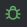 Start
Dette starter debuggingsesjonen. Du kan debugge hele løsningen, en modul eller en enkel enhetstest.

### 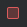 Stop
Dette stopper en påbegynt debuggingssesjon.

### 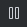 Pause
Om du er i en debuggingsesjon, men programmet kjører, kan du pause det.

### 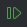 Resume
Om du har pauset programmet, enten med pauseknappen eller fordi programmet har stoppet på et *breakpoint*,
kan du fortsette kjøringen med denne knappen.

### 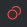 Breakpoints
Dette åpner en dialog som lister opp alle definerte breakpoints. 
Her kan de redigeres, og man kan definere nye.

### 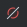 Mute breakpoints
Dette slår av eller på alle breakpoints midlertidig.

### 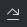 Step over
Når programmet er pauset på en kodelinje, gjør denne knappen at programmet går videre,
men stopper på neste linje i samme metode.

### 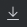 Step into
Når programmet er pauset på en kodelinje, gjør denne knappen at programmet går videre,
men stopper på første linje i metoden som kalles på den linjen.

### 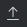 Step out
Når programmet er pauset på en kodelinje, gjør denne knappen at programmet går videre,
men stopper på første linje i metoden som kalte metoden den er inne i.

## Breakpoints

Breakpoints kan få programmet til å pause ved en gitt kodelinje.
Du kan legge til og fjerne dem ved å klikke helt til venstre i kodelinjen (på linjenummeret).
En fylt rød sirkel indikerer et aktivt breakpoint.

Høyreklikk på det for å redigere det eller skru det av midlertidig.

*Conditional breakpoints* er breakpoints som bare stopper programmet når et gitt uttrykk er sant.
Det kan være nyttig i en loop for å forhindre at den stopper hver gang.

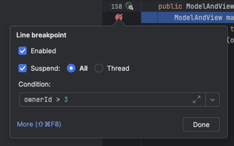

Vinduet for breakpoints () gir deg også mulighet 
til å pause debuggeren om spesielle exceptions blir kastet.

Du kan fortsette debuggeren til en ny linje ved å klikke i den og velge «run to cursor».
Da slipper du å definere et breakpoint (og rydde det opp).

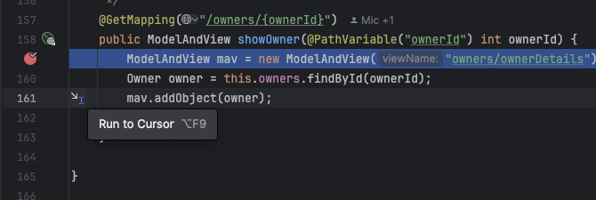

## Vinduer

### Console
Denne viser output fra debuggeren.

### Threads and variables
Når programmet er pauset, kan man se alle variabler og verdier som er i scope.
Den viser også stacken, med gjeldende nivå uthevet. Du kan navigere deg nedover i stacken og
se variabler for hvert nivå. De fleste variabler kan også endres i dette vinduet.
Du kan legge til *watches* som er variabler som alltid vil vises i dette vinduet.

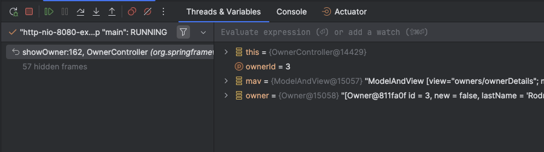

Komplekse objekter (som for eksempel `this`) kan ekspanderes, så man kan se variabler inne i disse.

### Evaluate expression

Med dette vinduet kan du gjøre metodekall og evaluere verdier som er i scope, mens programmet er pauset.

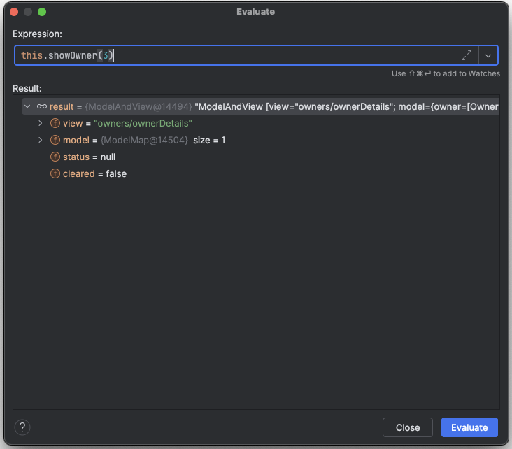

Vinduet kan utvides etter behov. Du åpner det enkelt ved å høyreklikke i koden mens programmet er pauset.

