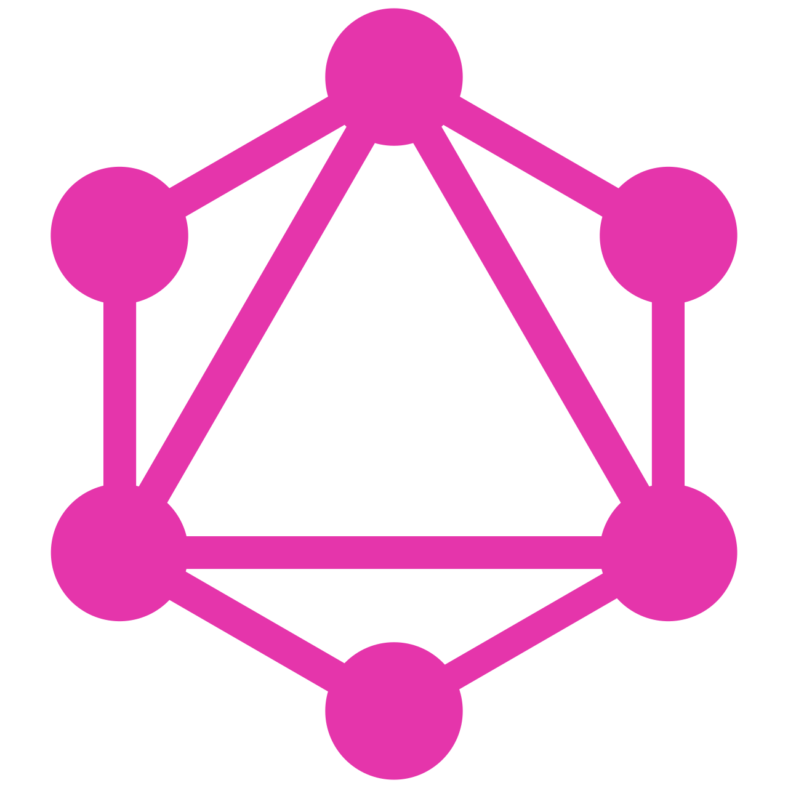

Open Data Protocol
=====

## Konsumere API

Prøv ut stegene i https://www.odata.org/getting-started/understand-odata-in-6-steps/ ved å bruke REST-client i IntelliJ eller PostMan.

GraphQL
=====

https://flyby-locations-sub.herokuapp.com/