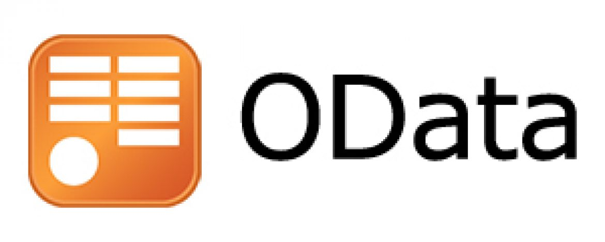

Open Data Protocol
=====



Prøv ut stegene i https://www.odata.org/getting-started/understand-odata-in-6-steps/ ved å bruke REST-client i IntelliJ eller PostMan.

GraphQL
=====


GraphQL definerer både schema og spørringene.

Github har et API for å søke i deres (våre?) data.

En sandkasse for å teste det i her https://docs.github.com/en/graphql/overview/explorer (Du må logge inn i Github for å få tilgang).

Du får code completion i editoren, så det er mulig å utforske formatet litt.

For eksempel å se hvem du er:

```GraphQL
query { 
  viewer { 
    login
  }
}
```
Andre ting å prøve (Hentet [herfra](https://docs.github.com/en/graphql/guides/forming-calls-with-graphql)):

```GraphQL
query {
  viewer {
    name
     repositories(last: 10) {
       nodes {
         name
       }
     }
   }
}
```

```GraphQL
query {
  repository(owner:"octocat", name:"Hello-World") {
    issues(last:20, states:CLOSED) {
      edges {
        node {
          title
          url
          labels(first:5) {
            edges {
              node {
                name
              }
            }
          }
        }
      }
    }
  }
}
```

```GraphQL
{
  repository(name: "oppdrift_backend", owner: "bekk") {
    assignableUsers{
      totalCount
    },
    createdAt,
    diskUsage,
    licenseInfo {
      name, url
    },
    projectsUrl,
    description,
    pullRequests (last: 10, states: MERGED) {
      nodes{
        author{
          login,
          url
        }
      }
    }
  }
}
```