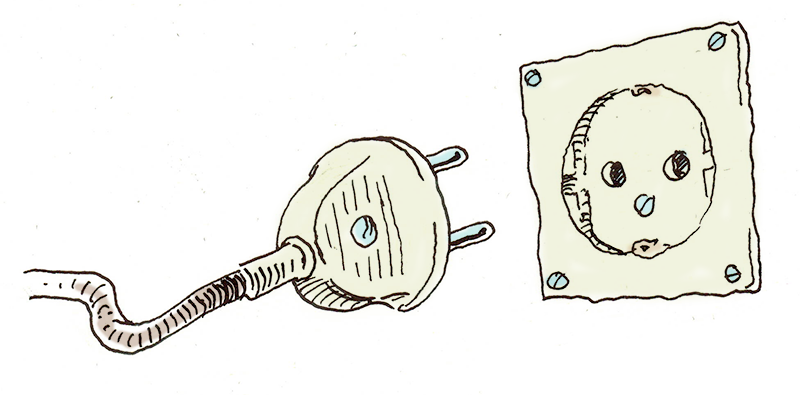
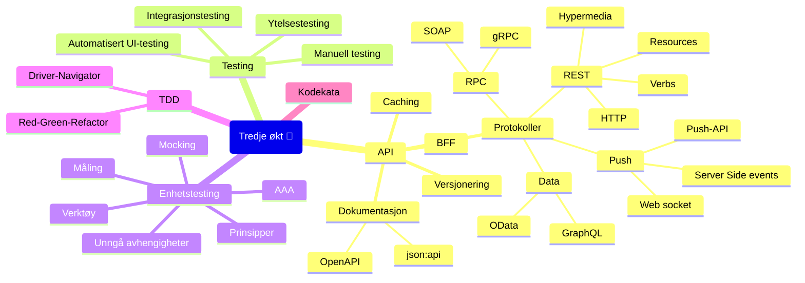

# Program for Oppdrift Backend tredje økt

Innholdet i denne økten består i hovedak av to deler; API-design og testing.

## API-design

API (_Application Programming Interface_) er utvilsomt et sentralt begrep for
backend-programmering. Vi bruker gjerne også «API» i sammenhenger der vi mener 
grensesnitt eller kontaktflate. Også klasser eller moduler har et API; de delene
som er eksponert ut.

Et API kan gjerne ses på som en kontrakt mellom tilbyder av grensesnittet og
konsumentene av det.

Hvordan vi designer et API er gjerne avhengig av om
- det er eksponert ut på nettet eller ikke
- om du kjenner alle konsumentene
- om det kun er beregnet for din egen front-end.

### BFF

_Backend for frontend_ er et pattern der man har et dedikert API for hver enkelt
type front-end. For eksmepel kan det være et eget API for mobile klienter.
Da kan man ha spesifikke endepunkt og schema for det.

Om klienten er din egen front-end er det ikke uvanlig å generere klient-kode 
fra API-et.

- [Backend for frontend](https://learn.microsoft.com/en-us/azure/architecture/patterns/backends-for-frontends)

### Dokumentasjon

En utfordring (særlig når du ikke kjenner konsumentene dine) er at det er et behov
for dokumentasjon av grensesnittet på et vis. Det er også et behov for å håndtere
endringer i kontrakten. Som utviklere er vi ofte ikke så glad i å skrive dokumentasjon
utenfor koden, da det er problematisk å holde den ved like når koden endrer seg,
og det er vanskelig å vite hvor mye dokumentasjon som er nyttig og tilstrekkelig.

### Json:api

Dette er et forsøk på å forenkle bruken av et API ved å standardisere formatet 
på json-meldingene i API-et, og parametre som API-et tar inn.

Det har et spesifikt format for 
- feilmeldinger
- koblinger mellom ulike ressurser på serveren
- paginering
- filtrering
- sortering

Det er vanskelig å finne eksempler der formatet er fulgt 100%, men det har 
allikevel nytte som en inspirasjon.

- [Dokumentasjon](https://jsonapi.org/)
- [Eksempel på et bibliotek](https://github.com/MarkoMilos/jsonapi)
- [Eksempel på bruk](https://occapi.uni-foundation.eu/occapi/v1/)
- [Eksempel på delvis bruk](https://api.tvmaze.com/shows/431)
- [HAL (en elternativ standard)](https://stateless.group/hal_specification.html)

### OpenAPI

Også (eller egentlig tidligere) kjent som Swagger.

Dette er et standardisert format for å beskrive et HTTP-basert API;
endepunkter, input-parameter, returverdier, forventede result-koder og annen beskrivelse.
Beskrivelsen er i Json eller Yaml, men den vises som regel i Swagger, som er en tjeneste
for å lese, bla i og teste API-et.

Den vanligste tilnærmingen er at dokumentasjonen genereres av annotasjoner på endepunktene
inline dokumentasjon (Jdoc eller tilsvarende) og vises med Swagger-middleware.

- [Wikipedia](https://en.wikipedia.org/wiki/OpenAPI_Specification)
- [😻](https://catfact.ninja)
- [Eksempel fra SVV](https://nvdbrapportapi.atlas.vegvesen.no/swagger-ui/)
- [Barnehagefakta](987117575)
- [Eksempel på bruk i Kotlin](https://www.baeldung.com/kotlin/swagger-spring-rest-api)

### Endringshåndtering

Når du gjør endringer i API-et som bryter kontrakten (breaking change), må dette
kunne kommuniseres til konsumentene på et vis.

Slike endringer kan være 

- endringer i formatet på innholdet
- endring i typen
- fjerning av deler av et API.

Måter å versjonere kan være

- URI-versjonering: at deler av path inneholder et versjonsnummer.
- Custom Request Header: At klientene ber om en spesifikk versjon med en custom header.
- Accept header: At klienene bruker content negotiation for å spesifisere hvilken versjon de vil ha

- [How to](https://restfulapi.net/versioning/)

### Pact

Pact er et forsøk på å invertere avhengighetsforholdet mellom konsument og tilbyder.
Det kalles «consumer driven contract».

Tilbyder genererer en beskrivelse av sitt API som sendes til en _broker_, en 
server som er tilgjengelig for konsumentene.

Konsumentene lager integrasjonstester som beskriver sin bruk av API-et; sitt behov
og sine forventinger. Disse kjører mot broker, som simulerer API-et. De kan senere
spille av disse mot det egentlige API-et for å verifisere at de gir forventet svar.

Når konsumenten gjør en endring, kjøres alle disse testene mot det nye API-et.
Om ingen av dem klager, betyr det at API-et i praksis ikke er endret. Ingenting som
er i bruk er brukket. Da trengs heller ikke et nytt versjonsnummer.

- [Pact](https://pact.io/)
- [Pactflow](https://pactflow.io/)

### Caching

Caching er en teknikk som brukes for å forbedre ytelsen ved aksessering av data.
Når tilgangen kan være kostbar (for eksempel pga kompliserte spørringer eller nettverkskall)
og skal aksesseres ofte, er det hensiktsmessig å mellomlagre dataene.

Et slikt mellomlager kalles en cache.

Med en cache vil framtidig aksess av dataene gå vesentlig raskere. Men det er svært
krevende å få caching til korrekt, og det kan være en kilde til mye gufne feil.

Caching kan skje i forkant av første aksessering, eller lazy; nå første konsument gjør at
det hentes. Den siste strategien kalles **read-through**.

Dersom konsumentene også skal gjøre endring på verdien, kan skriving skje til cachen. Dette kalles
**write-through**.

Alternativt kan skriving til datakilden føre til at cachen invalideres. Da kan den
**flushes**.

Om du bare har én instans av serveren, kan cachen holdes i minnet. Dette er enklest og raskest.
Dersom det finnes flere instanser, trengs det antagelig en **distribuert cache**.
Man kan også bruke en **CDN** (Content Delivery Network) for å cache statiske filer. Det er
servere som er spesiallaget for nettopp det formålet.

Man må også ta stilling til hvor lenge cachen skal leve for å unngå at den blir 
utdatert (**stale**). En kort levetid kan ha stor effekt i et system med mye trafikk.

HTTP har caching innebygget. Det styres i hovedsak med headeren `Cache-Control`.
En cache kan være `public` (felles for alle besøkende) eller `private` (alle har sin egen
[i nettleseren]). Selv om ikke en header er gitt, kan resultatet caches allikevel (f.eks om
det er lenge siden det ble endret). Dette kalles **heuristic cahing**.
`Vary`-headeren kan bestemme hva som skal brukes som nøkkel i cahen.
`Etag`-headeren kan sendes fra server som en slags versjonering. Klienten kan spørre 
om ressursen er endret med `If-None-Match`.

For å ikke cache resultatet kan server sende med `Cache-Control: no-cache` eller
`Cache-Control: no-store`.

Et vanlig triks for å overstyre cachen er å legge med et request-parameter som endres 
med nye versjoner. Dette kalles **Cache busting**.

- [Eksempel](./caching/nodejs/server.js)
- [MDN](https://developer.mozilla.org/en-US/docs/Web/HTTP/Caching)
- [RFC9111](https://httpwg.org/specs/rfc9111.html)
- [Caching tutorial](https://www.mnot.net/cache_docs/)
- [Caching strategies](https://codeahoy.com/2017/08/11/caching-strategies-and-how-to-choose-the-right-one/)
- [Et eksempel på at caching skaper økt kompleksitet, og at også det kan gå galt](https://www.kode24.no/artikkel/sann-fiksa-vg-utviklerne-valgtrobbelet-det-skar-seg-sa-voldsomt/80202419)

## Protokoller

Det finnes flere protokoller (og konvensjoner) man kan vurdere, avhengig av bruksområdet.

### SOAP

_Simple Object Access Protocol_ er en protokoll som ikke er så mye i bruk i moderne
løsninger. Den er basert på XML, og definerer i detalj kontrakten mellom konsument
og tilbyder. Både endepunkter og schema for parametre og resultat, samt feilhåndtering (faults).

SOAP-API har ofte et discovery-endepunkt som kan gi en beskrivelse av endepunktet
i WSDL-format (Web Services Description Language). Det finnes mange verktøy som kan
lese dette og generere all kode du trenger for å definere en klient (inkludert modeller).

- [Wikipedia: SOAP](https://en.wikipedia.org/wiki/SOAP)
- [Wikpedia: WSDL](https://en.wikipedia.org/wiki/Web_Services_Description_Language)
- [Eksempel](https://apps.learnwebservices.com/services/hello?WSDL)
- [SoapUI er det beste verktøyet for å jobbe med SOAP](https://www.soapui.org/)

### gRPC

gRPC er en protokoll som er utviklet av Google. Den bruker et binært format i transporten
mellom server og klient. Det er basert på HTTP/2, der den utnytter frames til å sende «trailing headers».

Det binære formatet kalles **Protocol Buffers**. Modellen defineres i såkalte proto-filer, og 
klient/server-kode kan genereres fra disse.

Det kan ikke brukes direkte i nettlesere, siden fetch-apiene ikke har implementert funksjonaliteten
fra HTTP/2 som brukes. Det er laget en workaround (gRPC Web) som baker inn trailing headers i 
body på meldingen. Det er avhengig av at serveren forstår dette, eller at det er satt opp en
proxy.

- [Introduksjon](https://grpc.io/docs/what-is-grpc/introduction/)
- [Wikipedia](https://en.wikipedia.org/wiki/GRPC)
- [gRPC web](https://grpc.io/docs/platforms/web/)

### Push- og duplex-protokoller

Ordinær HTTP-protokoll innebærer typisk at klienten tar initiativ til kommunikasjonen,
og at server svarer på henvendelsen. Dette kalles gjerne **pull**- eller **polling**-kommunikasjon.

Dersom klienten trenger å ha oppdatert informasjon til en hver tid (for eksempel i et 
status-dashboard eller lignende) må den spørre serveren hyppig om endringer.
Dette kan være problematisk for ytelsen om det er mange brukere av systemet som
gjør disse.

En annen tilnærming er å la serveren gi beskjed om det har skjedd endringer i dataene,
og sende disse til de klientene som har ytret interesse for dem.

- [Wikipedia](https://en.wikipedia.org/wiki/Push_technology)
- [ngrok](https://ngrok.com/)

### Web hook

Dette er mest aktuelt i en server-til-server-kontekst. Når noe skjer kalles et 
på forhånd definert endepunkt.

### Long polling

Dette utnytter en vanlig http-request, der serveren holder på den i stedet for å svare.
Når noe skjer sendes responsen tilbake.

Dette krever ikke at klienten kjenner andre protokoller, men kan være belastende for serveren
når det er mye trafikk. Noen klient-rammeverk bruker dette som en fallback-strategi om klienten 
ikke kan bruke noe mer moderne.

### Push-API/web-push

Dette er et klient-api, der en background-worker kan ta i mot meldinger fra serveren.

Da kan også klienten motta meldinger selv om ikke websiden er aktiv eller åpnet. Bruker
må akseptere å motta slike varsler for at det skal fungere.

- [Eksempel](./push-api)
- [MDN: Push API](https://developer.mozilla.org/en-US/docs/Web/API/Push_API)
- [W3C Working draft: Push API](https://www.w3.org/TR/push-api/)
- [Se alle service-workers i Chrome](chrome://serviceworker-internals/?devtools)

### Server Side Events

Dette er et klient-API for å motta push-meldinger.

- [Eksempel](./server-side-events)
- [En forklaring på Server side events](https://www.neerajsidhaye.com/posts/sse/sse/)

### Web Socker

Dette er en toveis-protokoll, der både klienten og server kan sende meldinger.
Klienten registrerer seg ved å sende en melding til server med header `Upgrade: websocket`.
Server svarer med `101`.

- [Eksempel](./websocket)
- [Wikipedia: WebSocket](https://en.wikipedia.org/wiki/WebSocket)
- [RFC6455](https://datatracker.ietf.org/doc/html/rfc6455)

### Data-API

Du bør aldri gi konsumenter direkte tilgang til databasen.
Da kortsluttes forretningslogikken, og det er vanskelig å ha kontroll på ytelsen.

Det finnes derimot dedikerte protokoller som kan brukes til å gjøre dataene tilgjengelige.
Det gjør det mulig for konsumentene å betjenes seg selv, og det er klart avgrenset
og veldefinert hvilke data som er tilgjengelig.

#### [OData](https://www.odata.org)

Dette er et API fra Microsoft. Det er REST-basert.

#### [GraphQL](https://graphql.org/)

Dette er laget av Facebook.
Det består av typedefinisjoner og har et spørrespråk.

Det er JSON-basert.

### REST

«REST» står for _representational state transfer_. Det handler, kort fortalt, om å bruke HTTP-standarden
slik den var ment. 

Man kan beskrive det i fire nivåer:

- **HTTP**: Et minstekrav er at HTTP brukes i kommunikasjonen.
- **Resources**: API-et beskriver ressurser. Dette er i motsetning til et RPC-type API, der metoder eksponeres for konsumentene. En url referer til en ressurs (eller et sett av ressurser).
- **HTTP verb**: Metodene `GET`, `POST`, `PUT`, `DELETE` og `PATCH` brukes for å indikere hvilken operasjon som skal utføres på ressursen.
- **Hypermedia controls**: Linker mellom ressurser kan gjøre det mulig for en konsument å navigere mellom ressurser. 

Man kan bruke query-parametre for å implementere søk/filtrering, paginering og sortering.

- [Wikipedia](https://en.wikipedia.org/wiki/Representational_state_transfer)
- [Maturity model](https://martinfowler.com/articles/richardsonMaturityModel.html)
- [Resource naming](https://restfulapi.net/resource-naming/)
- [MDN: HTTP methods](https://developer.mozilla.org/en-US/docs/Web/HTTP/Methods)
- [Method definitions](https://httpwg.org/specs/rfc9110.html#rfc.section.9.3)
- [En streng definisjon (Roy T. Fielding)](https://roy.gbiv.com/untangled/2008/rest-apis-must-be-hypertext-driven)
- [Pragamatic REST](https://www.ben-morris.com/pragmatic-rest-apis-without-hypermedia-and-hateoas/)
- [The REST of the ten commandments](https://hackernoon.com/the-rest-of-the-10-commandments?ref=hackernoon.com)
- [HATEOAS](https://en.wikipedia.org/wiki/HATEOAS)
- [JSON Patch; en standard for patch-meldinger](https://jsonpatch.com/)

## Testing

### Testtyper

Det finnes mange typer testing. Et forsøk på en [liste finnes her](https://glossary.istqb.org/en_US/search).

- **Akseptansetesting**: Valigvis en manuell test der kunden skal godkjenne en leveranse. Om det gjøres før produksjonsetting vil det blokkere utrullingsflyten.
- **Systemtest**: Test av et system, vanligvis isolert fra integrasjoner.
- **Regresjonstest**: En test av all funksjonalitet for å luke ut følgefeil av nye endringer. Det er egentlig bare realistisk å gjøre med automatisk testing.
- **A/B-test**: En metode for å teste ut funksjonalitet ved å sende ulike versjoner av koden til brukerne i produksjon. For eksempel kan 10% av brukerne få en versjon som har en liten endring fra resten. Ved å måle brukernes atferd, er det mulig å anslå om endringen fungerer bedre enn originalen. Dette krever automatisk utrulling, god overvåking av bruksdata og en viss mengde brukere.
- **Sikkerhetstest/PEN-test**: Dette er en test for å se om det er mulig å komme rundt systemets sikkerhetsmekanismer. Det gjøres ofte manuelt, men ved å ta i bruk verktøy for å utnytte kjente sikkerhetshull. Det kan enten skje som en «black-box»-test der testerne ikke kjenner til hvordan systemet er bugget, eller ved en analyse av kildekoden.
- **UU-test/compliance-test**: Dette er tester som ser etter brudd på spesifikke regelverk. For UU (tilgjengelighet) finnes det verktøy som gjør testingen enklere.

### Manuell testing

Dette er testing av løsningen som gjøres manuelt, ved å simulere brukere og følge test-script.
Utviklere er notorisk dårlige til å finne feil i egen kode, så litt av hensikten er at det er
noen som ikke kjenner til hvordan funksjonaliteten er utviklet som kan avsløre svakheter.

Manuell testing kan være satt opp slik at det innebærer en kvalitetskontroll av koden før den blir
integrert eller produksjonsatt. Det kan bety at det sinker produksjonstakten, siden ingen kode kan
bli ferdig før en ledig tester har sett på det.
Noen snakker derfor om at manuell testing må skje tidligere i utviklingsløpet, tettere på selve utviklingen.
Dette prinsippet kalles gjerne «shift left».

- [En oppsummering av manuell testing](https://www.simplilearn.com/manual-testing-article)
- [Dan North: We need to talk about testing](https://dannorth.net/we-need-to-talk-about-testing/)

### Ny og gammel modell for programvareutvikling

Tidligere var prosjektmodellen for programvareutvikling preget av at det var kostbart å få programvare ut til 
brukerne. Et overordnet fokus blir derfor å redusere feil i alle ledd, så det ikke kommer feil i produksjon.
Feilretting i produksjon vil være svært kostbart. 
Det blir derfor naturlig med tydelige faser, der man etter hver fase overleverer dokumentasjon eller kode
til neste fase. Vi kaller ofte en slik modell «fossefallsmodell», fordi hver fase kan ses på som ulike
platåer, der produktet renner nedover fra fase til fase.

En sentral metrikk er *bugs/line of code*.

En mer moderne prosjektmodell drar fordel av at selve produksjonsettingen er blitt mye billigere.
Det er fokus på å redusere tiden en funksjon bruker fra den er definert og prioritert til den er ute hos brukerne.
Vi kaller dette for «ledetid». For å få denne ned, er det nørvendig å automatisere alle trinn og unngå overleveringer.
Derfor blir det også mindre aktuelt med prosjektfaser.

En sentral metrikk er *mean time to repair*.

### Automatisert UI-testing

Automatisert testing av web-grensesnitt har to ulike formål:

#### Å kontrollere at løsningen fungerer på alle nettlesere og plattformer

Til dette brukes vanligvis tjenester som kan kjøre opp løsningen i mange ulike nettlesere.

- [BrowserStack](https://www.browserstack.com/)
- [Autify](https://autify.com/)
- [QA Wolf](https://www.qawolf.com/)
- [TestGrid](https://testgrid.io/)
- [Browserling](https://www.browserling.com/)

#### Automatisering av nettleser

Dette er typisk for å kjøre automatiserte  integrasjonstester eller ende-til-ende-tester 
som går gjennom brukergrensesnittet (i motsetning til å bruke API-et direkte).

- [Selenium](https://www.selenium.dev/)
- [Cypress](https://www.cypress.io/)
- [Playwright](https://playwright.dev/)

### Integrasjonstester

Integrasjonstester er tester som inkluderer systemer som er integrert (i motsetning til enhetstester).
Det kan plukke opp svakheter som oppstor i samspillet mellom to moduler eller systemer som enhetstester 
ikke plukker opp.

- [Wikipedia](https://en.wikipedia.org/wiki/Integration_testing)
- [Enhetstester men ingen integrasjonstest (⍶)](https://twitter.com/timbray/status/822470746773409794)
- [Enhetstester men ingen integrasjonstest (β)](https://www.foobarton.com/images/twounitnointegration.gif)
- [Enhetstester men ingen integrasjonstest (ɣ)](https://danielhall.io/what-about-unit-tests)

### Ytelsestester

Ytelsestester er automatiserte tester som simulerer mange brukere og høy trafikk for å 
verifisere at systemet tåler høy last.

- [Verktøy for ytelsestesting](https://www.techrepublic.com/article/load-testing-tools/)
- [Nok en liste](https://testguild.com/load-testing-tools/)

### BDD

«Behaviour Driven Development» tar i bruk testrammeverk som kan beskrive et funksjonelt krav eller
scenario som en kjørbar test.

Tanken er at forretningseier og fageksperter kan definere tester som beskriver systemets oppførsel,
ved å bruke sitt eget språk.

- [Introducing BDD (Dan North)](https://dannorth.net/introducing-bdd/)
- [Wikipedia](https://en.wikipedia.org/wiki/Behavior-driven_development)
- [Cucumber](https://cucumber.io/)
- [Specflow](https://specflow.org/)
- [Reqnroll](https://github.com/reqnroll/Reqnroll)
- [Concordion](https://concordion.org/)
- [JBehave](https://jbehave.org/)
- [Zephyr Enterprise](https://smartbear.com/test-management/zephyr-enterprise/?utm_medium=paid_listing&utm_source=sth&utm_campaign=best-bdd-tools-ze)
- [Fitnesse](https://fitnesse.org/)

## Enhetstester

Enhetstester (unit test) er tester som verifiserer og dokumenterer koden.
Den tester en enhet (unit) i isolasjon ved å kalle metoder med gitte parametre og
verifisere at resultatet stemmer med forventninger. En enhetstest kan også verifisere
at avhengige moduler har blitt kalt med gitte argumenter.

### Hva er en «enhet»?

Det vanligste er at en enhet (i sammenheng med enhetstester) er én klasse eller funksjon.
Den tester kun et public api av klassen (alle public metoder), og er i minst mulig grad avhengig
av de interne implementasjonsdetaljene.

Det kan også være hensiktsmessig å definere en gruppe av klasser som en enhet, og teste 
disse under ett.

### Testverktøy

De viktigste komponentene i enhetstesting er:

#### Testrammeverk (test framework)

Dette er et bibliotek du referer til i testprosjektet. Det har støtte for å annotere testmetoder
og metoder for å sette opp og rive ned avhengigheter. Det har også metoder for å
verifisere resultat (assertions).

#### Test runner

Dette er et program som er i stand til å finne de annoterte testmetodene, kjøre dem og vise
resultatet. Dette kan være integrert i IDE-en, eller være frittstående program.

Det er også en del av byggeservere, så man kan kjøre tester før de blir deployert.

#### Enhet (unit)

Dette er den delen av koden som skal testes. Det er alltid kun én enhet per test.
Dette kalles også «System Under Test» (SUT).

#### Enhetstest (unit test)

Dette er metoden som tester enheten. Det er vanlig å lage en test-klasse per enhet, og 
samle metodene som tester den der (men dette vil være avhengig av språk og rammeverk man velger).

#### Mocking framework

Dette er bibliotek man kan ta i bruk for å gjøre det lettere å bytte ut avhengigheter i
enheten med testklasser (test doubles).

### Testrammeverk

Hvilket rammeverk man velger vil være avhengig av språk og plattform koden kjører på.

- [JUnit 5](https://junit.org/junit5/)
- [TestNG](https://testng.org/)
- [MockK](https://mockk.io/)
- [Mockito](https://site.mockito.org/)
- [NUnit](https://nunit.org/)
- [xUnit](https://xunit.net/)
- [NCrunch](https://www.ncrunch.net/)
- [MSTest](https://github.com/microsoft/testfx)
- [Moq](https://github.com/devlooped/moq)
- [NSubstitute](https://nsubstitute.github.io/)

### Prinsipper for gode tester

En huskeregel for enhetstester er [FIRST](https://agileinaflash.blogspot.com/2009/02/first.html):

- **Fast**: Testene må være raske, slik at de blir kjørt ofte. En konsekvens er at de ikke bør ha avhengigheter på IO av noe slag.
- **Isolated**: En test må bare kunne feile av en grunn. Det betyr at når den feiler er det åpenbart hva som forårsaket det. Navnet på testen skal også beskrive dette.
- **Repeatable**: Testen skal gi det samme resultat hver gang. Det betyr at den ikke bør være avhengig av eksterne systemer. Den må heller ikke være avhengig av andre tester, og rekkefølgen de kjøres i. Man må også være forsiktig med å bruke tilfeldige og flyktige variabler i testen.
- **Self-Validating**: En test enten passerer eller feiler; det er aldri behov for å vurdere utfallet av en test.
- **Timely**: Testen skal skrives til rett tid. Dvs umiddelbart før koden den tester blir skrevet.

Et sett av slike tester skal kunne kjøres ofte og gi en trygghet om at koden fungerer slik det er forventet.
Testene kan derfor fungere sopm en dokumentasjon på produksjonskodens oppførsel.

- [Pragmatic Programmers](https://medium.com/pragmatic-programmers/unit-tests-are-first-fast-isolated-repeatable-self-verifying-and-timely-a83e8070698e)

### Unngå eksterne avhengigheter

For at testene skal være konsistente og raske, er det essensielt å fjerne alle avhengigheter som
kan ødelegge dette.

Det er typisk ting som databaser, filsystemet (for eksempel konfigurasjonsfiler), kall til nettverket
eller interop til andre prosesser.

Dette er bare mulig om man bruker IoC.

### To retninger for isolasjon

Det er to hovedskoler for isolasjon i enhetstesting.

Enten kan man isolere det man tester ved å mocke alle avhengigheter (London-skolen), eller så kan man
isolere testen og kun mocke delte avhengigheter (Detroit-skolen). I det siste tilfellet tester man gjerne 
større enheter.

Fordelen med den første tilnærmingen er at det er lettere å lage raske enkle tester.
Fordelen med den andre er at testene kan defineres på et litt høyere (ikke fullt så kodenært) nivå.
Det gjør at det ikke blir nødvendig å gjøre så mye endringer i testene om man refaktorerer koden.

- [London og Detroit](https://softwareengineering.stackexchange.com/questions/123627/what-are-the-london-and-chicago-schools-of-tdd#123672)

### Mocking

Mocking er prosessen der vi bytter ut avhengighetene i det vi tester med andre implementasjoner.
Om vi har brukt interfacer eller virtuelle metoder i avhengighetene, kan et mocking-rammeverk
generere nye instanser når vi kjører testen.

Når det vi tester (SUT) opprettes for testen sender vi inn (typisk i konstruktøren) falske
avhengigheter. Vi ønsker vanligvis ikke å teste avhengighetene, derfor byttes de ut med noe som 
ikke påvirker testen.

- [Mocking is not rocket science: Basics](https://blog.kotlin-academy.com/mocking-is-not-rocket-science-basics-ae55d0aadf2b)

### Mock/Stub

Det kan herske litt begrepsforvirring rundt navngivning på objektene vi generer med et
mocking-rammeverk. Overordnet heter disse «Test doubles».

En **stub** setter vi opp, så metoden under test kan kalle den og få data. Den skal aldri feile en test. Den erstatter *innkommende avhengigheter*.

En **mock** setter vi opp fordi metoden under test skal kalle den. Vi kan verifisere at den er kallt. Den erstatter *utgående avhengigheter*.

### Metrikk

Det finnes flere ting man kan telle etter å ha kjørt testene:

#### Testdekning (Test coverage)

De fleste test runnere kan registrere hvilke kodelinjer som har blitt kjørt i en test.
Ut fra dette kan man beregne andelen kodelinjer som er testet.

Det viser seg at dette er uheldig å bruke som et mål for kvalitet, siden det lett
fører til at det skrives tester som kun har som formål å skape testdekning. 
Det skaper tester som ikke egentlig løfter kvaliteten på løsningen og som kun
innebærer en vedlikeholdskostnad.

Det kan allikevel være en nyttig indikator. Testdekningen på forretningslogikk bør være 
høyere enn for presentasjonslogikk og dataaksessering.

#### Antall tester

Antall tester er en indikator på omfanget, og bør øke i takt med kodebasen ellers.

#### Tiden det tar å kjøre testene

Det er viktig at man holder et øye på denne. Om det tar for lang tid å kjøre testene
vil det gjøres sjeldnere. Det påvirker også byggetiden på server og derfor ledetiden.

#### Mutation testing

Dette er en teknikk (relatert til [chaos enginering](https://en.wikipedia.org/wiki/Chaos_engineering))
der man gjør tilfeldige endringer i koden som blir testet. 
Om testene fortsatt er grønne, er det en indikator på at de ikke egentlig tester noenting.

- [Wikipedia](https://en.wikipedia.org/wiki/Mutation_testing)

### Navn på testene

Navnekonvensjoner er avhengig av programmeringsspråk, testrammeverk og test patterns.
I Kotlin er det [mulig å navngi testmetodene i normalt språk](https://kotlinlang.org/docs/coding-conventions.html#names-for-test-methods).
Navnet bør uansett tydeliggjøre hvorfor en test feiler. Navnet er en dokumentasjon på 
antagelsen eller forventningen for testen.

Et mye brukt format er å dele navnet i tre (med `_` mellom delene) som beskriver

1) metoden man tester
2) argumenter eller premiss for testen
3) forventet resultat.

`CalculateRomanNumeral_WithArabicValue10_ReturnsX()`

- [How to choose the right name](https://www.softwaretestingmagazine.com/knowledge/how-to-choose-the-right-name-for-unit-tests/)
- [Conventions](https://medium.com/@stefanovskyi/unit-test-naming-conventions-dd9208eadbea)

### AAA

Et mye brukt format for å strukturere koden i en testmetode kalles «Triple A»:

1) **Arrange**: Her er alt oppsett for å koble sammen avhengigheter og opprette variabler som trengs i testen.
2) **Act**: Her kalles metoden som skal testes. Det er vanligvis bare en linje.
3) **Assert**: Her valideres resultatet eller mocker. Det er her testen feiler eller passerer.

### Setup/Teardown

Testrammeverkene tilbyr vanligvis å skrive metoder for oppsett og opprydning før og etter testene kjøres.
Dette kan redusere duplisert kode i testmetodene. Det kan også føre til at testene blir mindre leselige,
om mye av konteksten flyttes ut av testen.

### TDD

Testdrevet utvikling (Test Driven Development) betyr at testen skrives før koden som skal testes.
Effekten er vanligvis en bedre strukturert kode, siden man tvinges til å tenke på det 
koden/metoden skal gjøre på et litt mer overordnet nivå.

### Red – Green – Refactor

Arbeidsflyten i TDD er som følger:

1) **Red**: Skriv en test som feiler. For å få testen til å kompoilere og kjøre kan det være nødvendig å definere klassen og metoden man skal teste, men uten innhold. (Det er vanlig å la den kaste en exception når den kalles.)
2) **Green**: Implementer metoden som tester så testen passerer.
3) **Refactor**: Forbedre koden, fjern duplikater etc. Så lenge testen er grønn, er man trygg på at ingenting er ødelagt i refaktoreringen.
4) Begynn på neste test.

### Driver – Navigator

Når man parprogrammerer, er dette en nyttig metodikk.

Den som sitter ved tastaturet skriver koden og tar alle avgjørelser om syntaks.

Den som navigerer bestemmer hva som skal kodes og har den kreative rollen.
Navigatøren slipper å tenke på det rent kodenære og kan fokusere på det litt mer overordnede.

Man bytter rolle mellom hvere test.

- [Martin Fowler](https://martinfowler.com/articles/on-pair-programming.html)
- [Mob programming](https://mobprogramming.org/)

### Kodekata

Kata er en teknikk fra kampsport, der man øver på spesifikke bevegelser og kombinasjoner
for å innarbeide muskelminne.

Begrepet er stjålet i programmering, og handler om å trene på å løse de samme problemene flere ganger.
Det er en måte å lære seg kodehåndtverk, problemløsning og nye programmeringsspråk.

Det er veldig egnet for å trene på TDD.

- [CodeKata](http://codekata.com/)
- [GUVI](https://www.guvi.in/code-kata/)
- [Jeff Atwood](https://blog.codinghorror.com/the-ultimate-code-kata/)
- [Coding dojo](https://codingdojo.org/kata/)
- [Awesome katas](https://github.com/gamontal/awesome-katas)

---

---
[Presentasjon 📽](https://github.com/bekk/oppdrift_backend/blob/main/del_2/Kurspresentasjon_2.pptx)