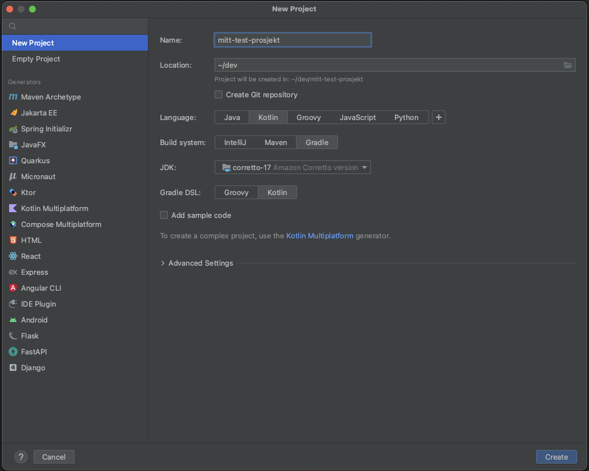
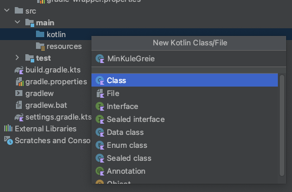
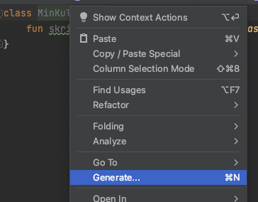
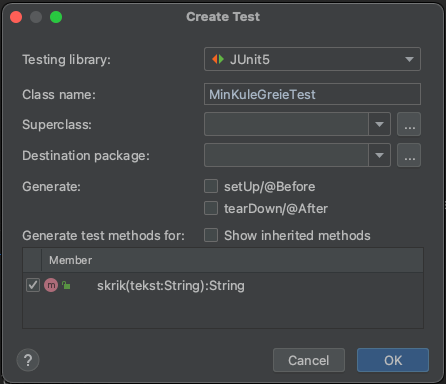
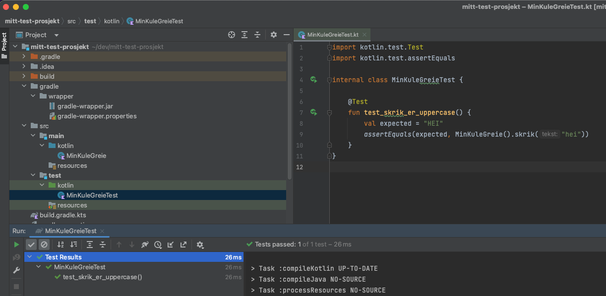

# Testing i Kotlin

Start med å lag et Kotlin-prosjekt (file -> new project). 




Opprett en ny fil i Kotlin-mappa under `src/main/kotlin`.



Lag en klasse med en enkel funksjon, f.eks:

```kotlin
class MinKuleGreie {
    fun skrik(tekst: String) = tekst.uppercase()
}
```

Marker klassen og velg `Generate...` eller bruk snarveien `cmd-N`. 



Velg deretter JUni5 (og trykk `Fix` hvis du får beskjed om at Intellij ikke finner testrammeverket). 
Huk av funksjonen du har laget i klassen for å generere en enkel test for den.



Kjør testen ved å klikke på den grønne pila.



## kotlin.test / Jupiter / JUnit


```kotlin
import kotlin.test.Test
import kotlin.test.assertEquals

internal class MinKuleGreieTests {

    @Test
    fun skrik_withText_returnsUppercase() {
        val expected = "HEI"
        
        val result = MinKuleGreie().skrik("hei")
        
        assertEquals(expected, result)
    }
}
```

Les mer på: https://kotlinlang.org/docs/jvm-test-using-junit.html

## Andre nyttige testrammeverk

### Spek

https://www.spekframework.org/

Kotlin DSL for å kunne skrive penere tester. Syntaksen minner om JavaScript testrammeverket Jasmine.
Eksempel på tester skrevet med Spek:

```kotlin
object CalculatorSpec: Spek({
    describe("A calculator") {
        val calculator by memoized { Calculator() }

        describe("addition") {
            it("returns the sum of its arguments") {
                assertEquals(3, calculator.add(1, 2))
            }
        }
    }
})
```

### Mockk

https://mockk.io/

Et Kotlin-rammeverk for mocking. Mocking kan være nyttig når man ønsker å teste kompliserte løsninger som henger tett sammen.