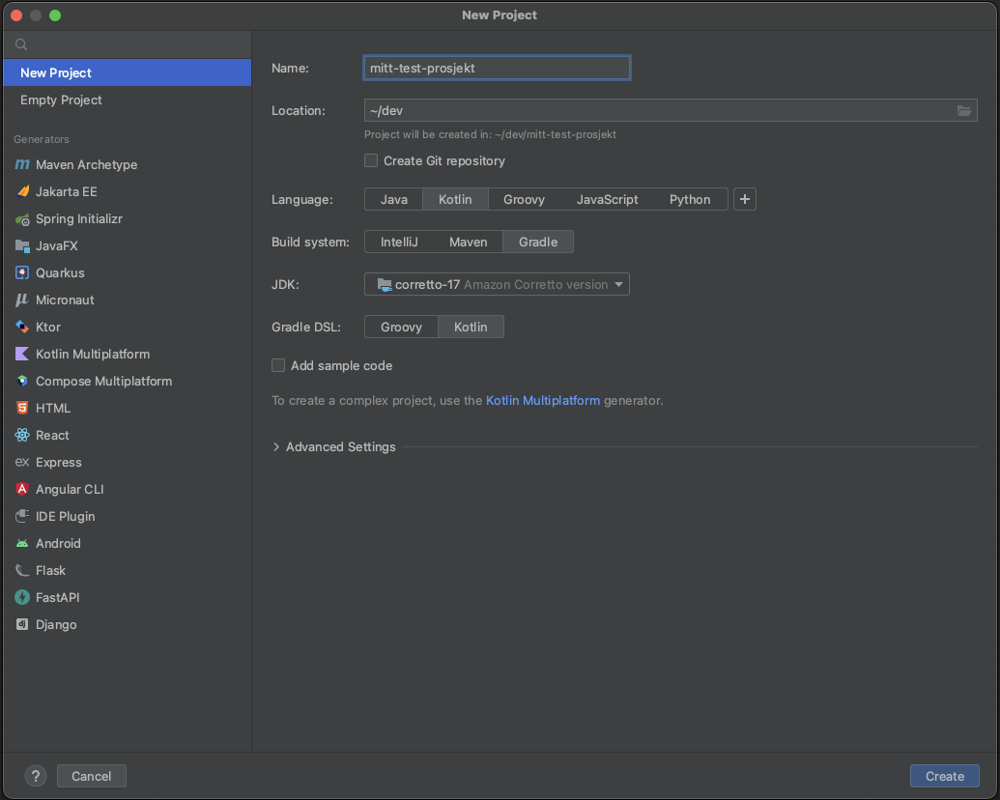
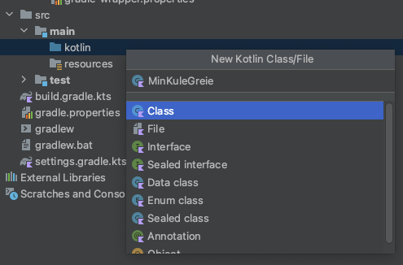
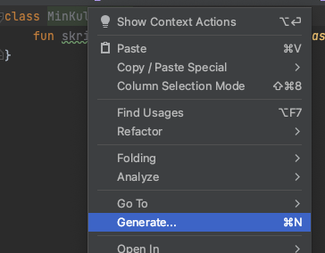
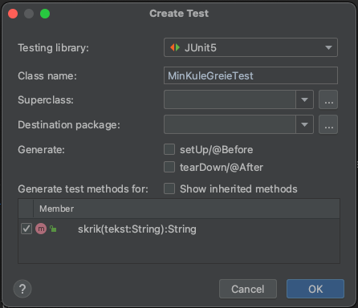
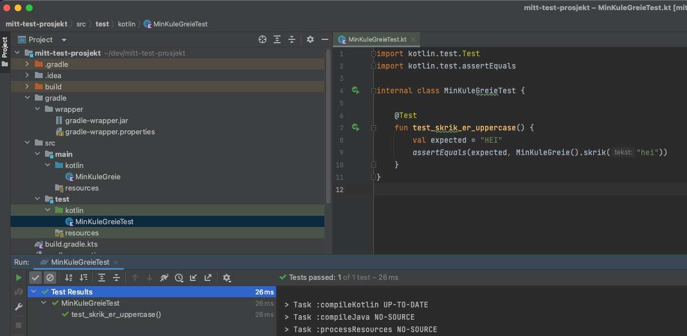

# Testing i Kotlin

> [!NOTE]
> Hensikten med denne øvelsen er å bli i stand til å opprette enhetstester i Kotlin.

Start med å lag et Kotlin-prosjekt (file -> new project). 




Opprett en ny fil i Kotlin-mappa under `src/main/kotlin`.



Lag en klasse med en enkel funksjon, f.eks:

```kotlin
class MinKuleGreie {
    fun skrik(tekst: String) = tekst.uppercase()
}
```

Marker klassen og velg `Generate...` eller bruk snarveien `cmd-N`. 



Velg deretter JUni5 (og trykk `Fix` hvis du får beskjed om at Intellij ikke finner testrammeverket). 
Huk av funksjonen du har laget i klassen for å generere en enkel test for den.



Kjør testen ved å klikke på den grønne pila.



## kotlin.test / Jupiter / JUnit


```kotlin
import kotlin.test.Test
import kotlin.test.assertEquals

internal class MinKuleGreieTests {

    @Test
    fun skrik_withText_returnsUppercase() {
        val expected = "HEI"
        
        val result = MinKuleGreie().skrik("hei")
        
        assertEquals(expected, result)
    }
}
```

Les mer på: https://kotlinlang.org/docs/jvm-test-using-junit.html

## Andre nyttige testrammeverk

### Kotest

https://kotest.io/

Kotlin-native testrammeverk med en fleksibel DSL, støtte for data-drevne tester og property-based testing. 
Aktivt vedlikeholdt og det foretrukne alternativet til JUnit5 i Kotlin-prosjekter.

Eksempel med Kotest:

```kotlin
class CalculatorSpec : StringSpec({
    "1 + 2 should equal 3" {
        Calculator().add(1, 2) shouldBe 3
    }
})
```

Kotest støtter også **property-based testing**, der tilfeldige inputverdier genereres automatisk for å avdekke kanttilfeller:

```kotlin
class CalculatorPropertySpec : StringSpec({
    "addition should be commutative" {
        checkAll<Int, Int> { a, b ->
            Calculator().add(a, b) shouldBe Calculator().add(b, a)
        }
    }
})
```

### Mockk

https://mockk.io/

Et Kotlin-rammeverk for mocking. Mocking kan være nyttig når man ønsker å teste kompliserte løsninger som henger tett sammen.

## Integrasjonstester med Testcontainers

https://testcontainers.com/

Testcontainers lar deg starte opp ekte tjenester (databaser, Kafka, Redis osv.) i Docker-containere som en del av testene. Det er nå standard tilnærming for integrasjonstester i JVM-prosjekter fordi det eliminerer behovet for mock-databaser og sikrer at testen treffer den faktiske databasen.

Spring Boot 3.1+ har innebygd støtte via `@ServiceConnection`:

Legg til i `build.gradle.kts`:

```kotlin
testImplementation("org.springframework.boot:spring-boot-testcontainers")
testImplementation("org.testcontainers:postgresql")
testImplementation("org.testcontainers:junit-jupiter")
```

Eksempel:

```kotlin
@SpringBootTest
@Testcontainers
class UserRepositoryTest {

    companion object {
        @Container
        @ServiceConnection
        val postgres = PostgreSQLContainer("postgres:16")
    }

    @Autowired
    lateinit var userRepository: UserRepository

    @Test
    fun `getUsers returns all users`() {
        val users = userRepository.getUsers()
        assertThat(users).isNotEmpty()
    }
}
```

Spring Boot starter en ekte Postgres-container, kobler til automatisk og river den ned etter testen.

- [Testcontainers med Spring Boot](https://docs.spring.io/spring-boot/reference/testing/testcontainers.html)
- [Testcontainers Kotlin-modul](https://testcontainers.com/guides/testing-spring-boot-rest-api-using-testcontainers/)