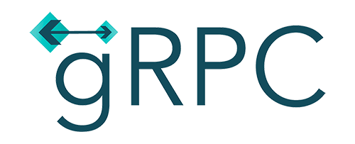

gRPC Workshop
=============

> [!NOTE]
> Hensikten med denne øvelsen er å få et lite innblikk i hvordan man setter opp
> en klient og en server og kommuniserer med gRPC.

Gå gjennom **Quick start**: https://grpc.io/docs/languages/kotlin/quickstart/ (Hello world).
