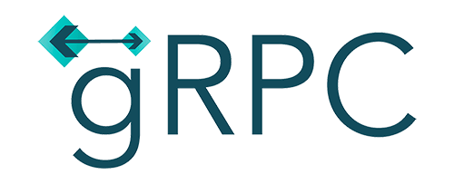

gRPC Workshop
=============

> [!NOTE]
> Hensikten med denne øvelsen er å få et lite innblikk i hvordan man setter opp
> en klient og en server og kommuniserer med gRPC.

Gå gjennom **Quick start**: https://grpc.io/docs/languages/kotlin/quickstart/ (Hello world).

> [!NOTE]
> Om du har problemer med å kompilere, endre verdien i /examples/stub-lite/build.gradle.kts linje 17
> `kotlin { jvmToolchain(17) }` til `kotlin { jvmToolchain(11) }` og prøv igjen.
