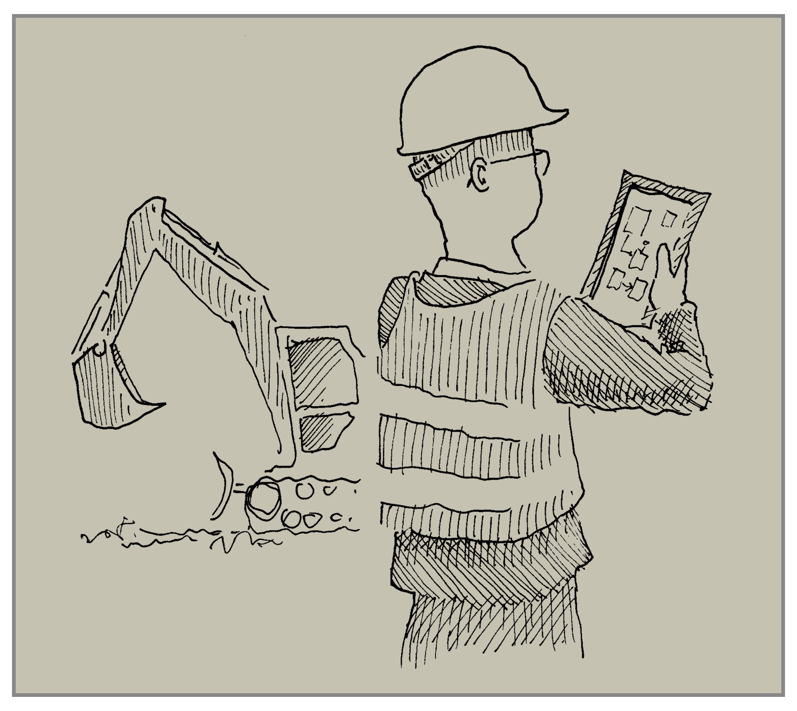
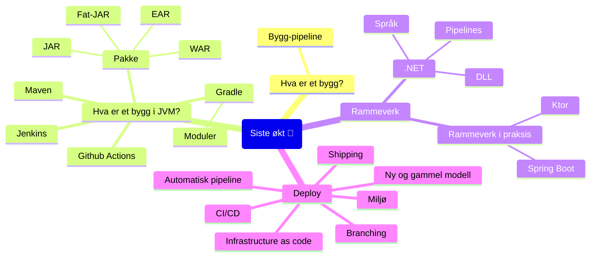

# Oppdrift Backend fjerde økt

Rammeverk og deployment

## Øvelser

- [.NET](./dotnet/README.md)
- [Bygg en JAR](./jar.md)
- [Ktor, getting started](https://ktor.io/docs/intellij-idea.html) Dette er en enkel innføring i oppsett av Ktor for å lage en enkel løsning.
- [Deploy med Fly.io](./deploy-fly.md)
- [GitHub Actions Workshop by GitHub](https://github.com/actions-workshop/actions-workshop) Hvis du kjenner til Github Actions, kan du hoppe over del 1. Del 2, 3 og 4 er verdt en titt uansett erfaring med Github Actions - om enn bare for inspirasjon til hva dere kan gjøre i deres egne byggpipelines.

## Ressurser

[Innhold](innhold.md)

---

```mermaid
mindmap
  root(Siste økt 🧭)
    Hva er et bygg?
        Bygg-pipeline
    Hva er et bygg i JVM?
        Pakke
            JAR
            Fat-JAR
            WAR
            EAR
        Maven
        Gradle
            Moduler
        Jenkins
        Github Actions
    Rammeverk
        .NET
            Språk
            DLL
            Pipelines
        Rammeverk i praksis
            Spring Boot
            Ktor
    Deploy
        Shipping
        Ny og gammel modell
        Automatisk pipeline
        Miljø
        Branching
        CI/CD
        Infrastructure as code
        
```
