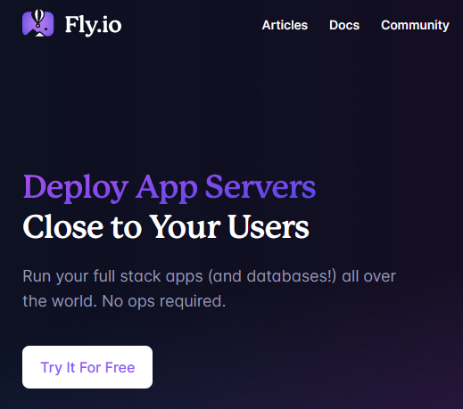
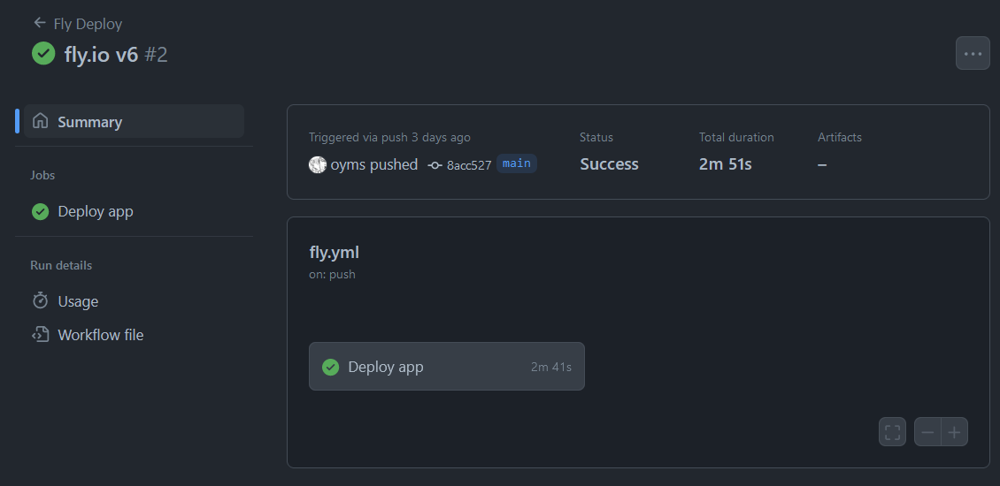

# Deploy av Spring Boot med Fly

Målet for i dag er å få deploya applikasjonen vår ut på internett. 

Det første steget er å sjekke at applikasjonen starter opp lokalt og svarer på port 8080.
Det er også mulig å ta utgangspunkt i [eksempel prosjektet](https://github.com/veiset/kotlin-spring-flyway-rest-example) og starte derfra.

Start applikasjonen og sjekk at http://localhost:8080/api/users fungerer.

## Actuator

Systemet som starter opp applikasjonen trenger å vite at appen er oppe og frisk. 
Actuator er endepunkt som sier noe om status på applikasjonen, typsik vil dette være om appen har startet opp rett,
ressusjbruk og egendefinerte metrics.

Legg til spring-boot-starter-actuator for å automatisk få disse endepunktene.

```kotlin
dependencies {
    ...
    implementation("org.springframework.boot:spring-boot-starter-actuator")
    ...
}
```

Restart appen (husk å trykk på elefanten for å installere nye avhengigheter). 
Når appen starter opp sjekk at du får svar på: http://localhost:8080/actuator/health

## Dockerfile

Vi trenger en Dockerfile som beskriver hvordan applikasjonen vår skal bygges og pakkes sammen til et docker image.

```Dockerfile
FROM gradle:7 AS build
COPY --chown=gradle:gradle . /home/gradle/src
WORKDIR /home/gradle/src
RUN gradle build --no-daemon

FROM eclipse-temurin:17
EXPOSE 8080:8080
RUN mkdir /app
COPY --from=build /home/gradle/src/build/libs/*.jar /app/backend.jar
ENTRYPOINT ["java","-jar","/app/backend.jar"]
```

## Fly.io

Registrer en konto med [fly.io](https://fly.io). Veldig enkel signup ved å bruke GitHub kontoen din.



Følg guiden på fly.io for å installere Fly sitt toolkit (flyctl).


## Deploy til Fly.io

Gå til mappen med prosjektet (eller trykk på terminal-knappen i intellij).

Logg inn og deploy med flyctl

```bash
flyctl auth login
flyctl launch
```

Gå til `https://<generert-navn>.fly.dev/api/users`


## GitHub Actions (Bonus oppgave)

Denne delen krever at du oppretter et GitHub prosjekt for applikasjonen din. 
Gå til GitHub og opprett et nytt prosjekt.

Legg til filen `.github/workflow/fly.yml`, med følgende innhold:

```yml
name: Fly Deploy
on:
  push:
    branches:
      - main
jobs:
  deploy:
    name: Deploy app
    runs-on: ubuntu-latest
    steps:
      - uses: actions/checkout@v3
      - uses: superfly/flyctl-actions/setup-flyctl@master
      - run: flyctl deploy --remote-only
        env:
          FLY_API_TOKEN: ${{ secrets.FLY_API_TOKEN }}
```

Hent ut Fly API token ved å skrive `flyctl auth token` og legg denne til som en repository secret med navn `FLY_API_TOKEN` 
på GitHub (Settings -> Secrets and Variables -> Actions -> New repository secret)

Etter dette er satt opp vil appen automatisk bli bygd og deployet når ny kode blir pushet til `main`-branchen. 
Gå til repoet på GitHub å følg med på hva som skjer under `Actions`-fanen.



Sjekk ut fly sin [offisielle dokumenasjon på GitHub Actions](https://fly.io/docs/app-guides/continuous-deployment-with-github-actions/)
for mer info.

