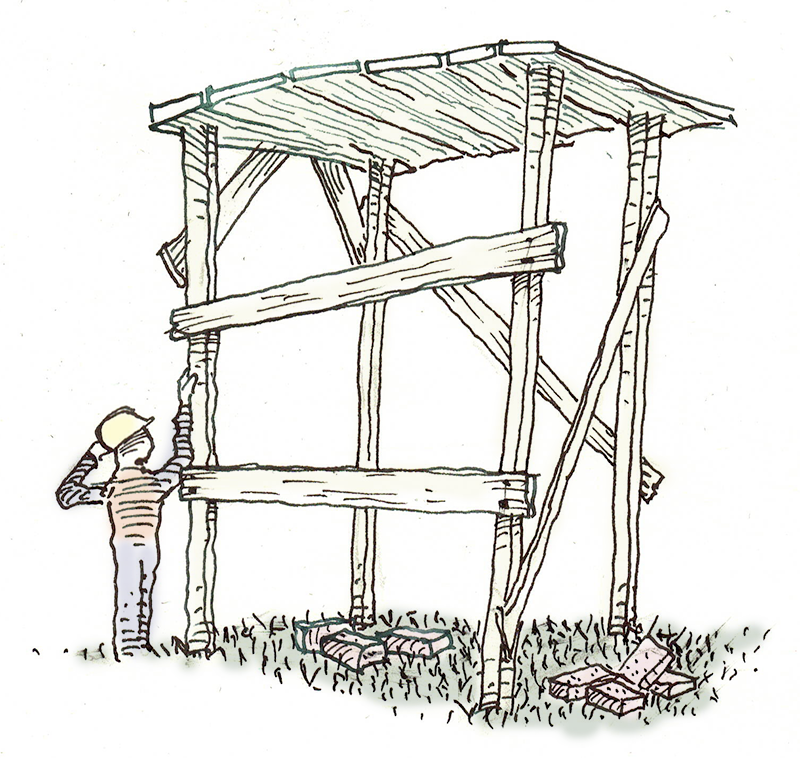
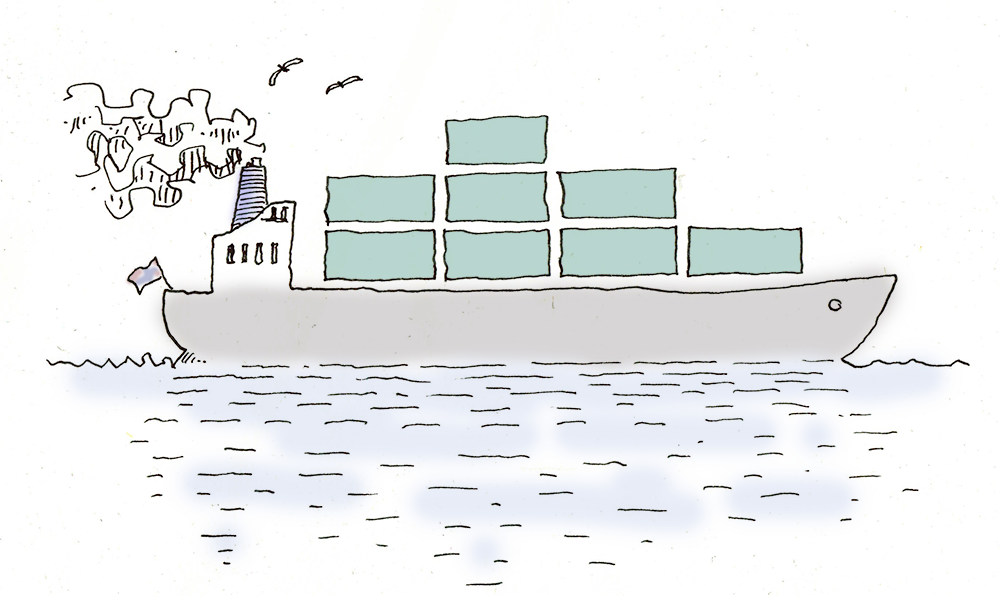
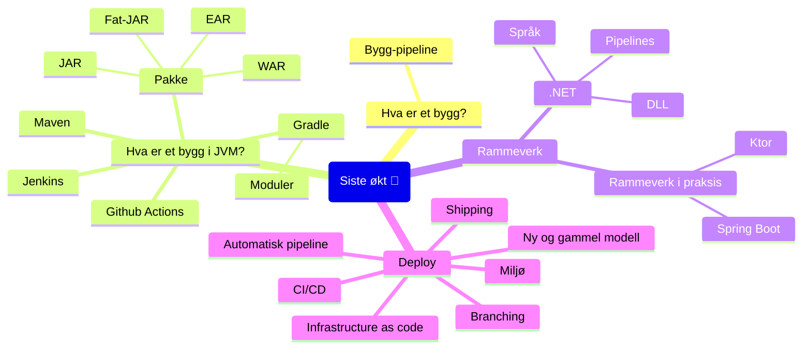

# Program for Oppdrift Backend fjerde økt

Innholdet i denne siste økten handler om rammeverk og deployment.

## Hva er et bygg?

Også metaforen «bygg» er hentet fra arkitekturen.

Vi tenker på bygg som noe som er laget fra koden og kan installeres og kjøres på en server.
Det er vanligvis kompilert kode som er pakket inn, så den er praktisk å deployere.

### Bygg-pipeline

En pipeline er et sett av operasjoner som går i sekvens (hovedsaklig) som går fra kildekode til 
en ferdig produksjonsklar pakke, kjørende i et test- eller produksjonsmiljø.

Det består, overordnet sett, av operasjonene:
*Clean → Build → Test → Analyse → Deploy → Verifisering*

En bygg-pipeline er kan være helautomatisk, uten manuelle steg.
Den kan også inneholde steg som baserer seg på at et menneske skal godkjenne
pakken før den går videre.
Den startes vanligvis når en endring oppdages i kildekodesystemet.

Om et av stegene feiler, stoppes hele prosessen, så man ikke risikerer å deploye
noe som ikke har passert kvalitetskontroll.

#### Clean

Dette er kort fortalt å fjerne alle artifakter etter tidligere kompileringer og bygg.
Det tvinger kompilatoren til å gjøre en fullstendig kompilering.

#### Build

I dette trinnet skjer kompilering (eller transpilering) og linking av biblioteker.
Det er første valideringssteg.

*Kompilering* er prosessen som tar høynivå-språk og oversetter det til språk på
lavere nivå. Når kilde- og målspråket har omtrent samme nivå, kalles det også
*transpilering*.

- [Kompilering](https://en.wikipedia.org/wiki/Compiler)
- [Transpilering (source-to-source compiler)](https://en.wikipedia.org/wiki/Source-to-source_compiler)

#### Testing

I dette trinnet kjøres enhetstester og automatiserte integrasjonstester.

#### Analyse

Her kjøres mer overordnede tester og kontroller av koden.
Det kan for eksempel være kode som ser etter sikkerhetshull, eller brudd
på vedtatte standarder og prinsipper.

#### Verifisering

Dette steget er ofte manuelt, og innebærer testing og kontroll av løsningen
før (eller like etter at) den er gått i produksjon.
Akseptansetest kan også være en del av dette.

### Deploy

Dette er prosessen der produktet av bygg-pipeline blir installert på serveren
det skal kjøre på og gjort tilgjengelig for brukerne.
Vi kaller det også «utrulling».

I moderne web-løsninger er det en forventning om at utrulling skjer uten nedetid.
Det vil si at brukerne skal kunne bruke løsningen mens den oppgraderes.

- [Deployment models explained](https://www.linkedin.com/pulse/deployment-models-explained-rizwana-begum/)

#### Blue/Green deployment

Dette er en strategi der to identiske miljøer kjører i produksjon.
Det ene er eksponert til brukerne (blue), mens det andre går på tomgang (green).

Ved deploy kan miljøet i bakgrunnen oppgraderes. Etter at det er verifisert og klart,
kan man flytte brukerne over på det nye miljøet. Dette kan gjøres med DNS eller
med en lastbalanserer.

Om det oppdages alvorlige feil, er det enkelt å reversere prosessen.

Når produksjonsmiljøet er stabilt, kan det andre miljøet oppgraderes og settes i hvilemodus.

Dette kalles også «red-black» eller «red-green».

#### Shadow

To miljøer kjører i produksjon. En av dem blir oppgradert med ny kode.
Brukerne rutes fremdeles til den gamle, men en kopi av requestene rutes til den nye.
Da kan man overvåke ytelse og om responsen samsvarer med den gamle versjonen av koden.

Når man stoler på den nye versjonen, blir brukerne flyttet over.

#### Canary

I denne varianten blir den nye koden rutet til en liten andel av brukerne. 
Systemet kan overvåkes under realistisk bruk, men konsekvensene er redusert om
det går galt. Andelen brukere på den nye koden kan skrus gradvis opp, til 
man til slutt ruter alle over på ny løsning.

- [Canary in a coalmine](https://dictionary.cambridge.org/dictionary/english/canary-in-a-coalmine)

## Hva er et bygg i Java/JVM?

Litt mer om detaljene rundt bygg i [JVM](https://en.wikipedia.org/wiki/Java_virtual_machine).

### JAR – Java archive

*JAR* står for «Java Archive». Det er i prinsippet en zip-fil med strukturert innhold.
De inneholder en manifest-fil som beskriver innholdet. Denne har filnavnet `META-INF/MANIFEST.MF`.

Filen kan være signert, for å sikre mot at den er endret av en tredjepart.
Den inneholder også versjonsinformasjon.

Om det er en kjørbar jar-fil, har den en oppføring i manifestet om et *entry point* (`Main-Class`).
Den kan kjøres med kommandoen `java -jar foo.jar`.

- [Wikipedia](https://en.wikipedia.org/wiki/JAR_(file_format))

### Fat-JAR

Også kalt «uber JAR». Det er en teknikk der man, i stedet for å linke til avhengigheter i en
JAR, pakkes alle kjøretidavhengigheter inn i én fil. Det forenkler distribusjon, siden det bare er
én fil som trengs for å kjøre applikasjonen.

- [Dokumentasjon](https://docs.gradle.org/current/userguide/working_with_files.html#sec:creating_uber_jar_example)

### WAR

*WAR* står for «Web Application Resource». Det er en fil der alle ressurser som
kreves for en web-applikasjon pakkes sammen (inkludert JAR-filer).

- [Wikipedia](https://en.wikipedia.org/wiki/WAR_(file_format))
- [JRE](https://en.wikipedia.org/wiki/Java_(software_platform)#Java_Runtime_Environment)

### EAR

*EAR* står for «Enterprise Application aRchive». Det er en utvidelse av JAR-formatet
for deployment til servere, brukt av Jakarta EE.

- [Wikipedia](https://en.wikipedia.org/wiki/EAR_(file_format))
- [Jakarta EE](https://en.wikipedia.org/wiki/Jakarta_EE)

## Byggsystem for JVM

Det er to dominerende alternativer; [Gradle](https://gradle.org/) og [Maven](https://maven.apache.org/).
Begge håndterer byggeprosessen, og avhengigheter.

- [Differences between Gradle and Maven](https://www.geeksforgeeks.org/difference-between-gradle-and-maven/)

### Maven

Maven bruker XMl som format i konfigurasjonsfilene. Det har en relativt rigid struktur på
konfigurasjonsfilene, men med «Convention over Configuration», kan det føre til mindre
konfigurasjon for standardmønstre.

### Gradle

Gradle er et nyere verktøy enn Maven.
Gradle bruker et [DSL](https://en.wikipedia.org/wiki/Domain-specific_language) for 
konfigurasjon. Det åpner for imperativ programmering i konfigurasjonen. 

# Rammeverk

Et rammeverk gir struktur for applikasjonen. Det legger sterke føringer
på hvordan løsningen er strukturert, og kan ikke enkelt skiftes ut.
Å velge rammeverk er en arkitekturavgjørelse.

Det er rammeverket som kaller din kode, i motsetning til biblioteker, der du kaller dem.

- [Wikipedia](https://en.wikipedia.org/wiki/Software_framework)
- [Hollywood Principle (Inversion Of Control)](https://martinfowler.com/bliki/InversionOfControl.html)

## Eksempler på rammeverk

- [Spring](https://spring.io/projects/spring-framework): Applikasjonsrammeverk og IoC-container for [JVM](https://en.wikipedia.org/wiki/Java_virtual_machine)
- [Play](https://en.wikipedia.org/wiki/Play_Framework): Webrammeverk skrevet i [Scala](https://www.scala-lang.org/)
- [ASP.NET](https://dotnet.microsoft.com/en-us/apps/aspnet): Webrammeverk for [dotnet](https://dotnet.microsoft.com/en-us/)
- [Ruby on Rails](https://rubyonrails.org/): Webrammeverk for [Ruby](https://www.ruby-lang.org/en/)
- [Express](https://expressjs.com/): Webrammeverk for [Node](https://nodejs.org/en)
- [Symfony](https://en.wikipedia.org/wiki/Symfony): Webrammeverk for [PHP](https://www.php.net/)
- [Phoenix](https://en.wikipedia.org/wiki/Phoenix_(web_framework)): Webrammeverk skrevet i [elixir](https://elixir-lang.org/)
- [Xamarin](https://dotnet.microsoft.com/en-us/apps/xamarin): Mobilrammeverk for [dotnet](https://dotnet.microsoft.com/en-us/)

- [The mother of all demo apps](https://codebase.show/projects/realworld?category=backend)

## .NET

Dotnet har vært det tradisjonelle alternativet til Java og JVM, både som et
rammeverk, kjøretidssystem og økosystem.

Det er hovedsaklig utviklet av Microsoft, delvis gjennom 
[.NET Foundation](https://dotnetfoundation.org/), og er 
lisensiert under en [MIT-lisens](https://github.com/aws/mit-0) (open-source).

Det er som JVM, cross-platform og basert på [JIT-kompilering](https://en.wikipedia.org/wiki/Just-in-time_compilation)
og en [virtuell maskin](https://en.wikipedia.org/wiki/Virtual_machine#Process_virtual_machines).

- [dotnet](https://dotnet.microsoft.com/en-us/)
- [Get started](https://dotnet.microsoft.com/en-us/learn)

### Historikk

[.NET Framework](https://en.wikipedia.org/wiki/.NET_Framework) og språket
[C#](https://dotnet.microsoft.com/en-us/languages/csharp) ble lansert av 
Microsoft i 2000.

Det var laget som et svar på populariteten til Java, som kom på nittitallet.
Java garanterte *WORA* ([Write once, run anywhere](https://en.wikipedia.org/wiki/Write_once,_run_anywhere)).
Det hadde run-time-miljøer for de fleste populære platformer, automatisk
garbage collection.
Java var eid av [Sun](https://en.wikipedia.org/wiki/Sun_Microsystems) og var 
ikke open-source, men lisensene ble solgt billig.

.NET kunne bare kjøre på Windows, og var heller ikke open-source. Både språket C# 
og CLI (Common Language INfrastructure) ble standardisert som en åpen ECMA og 
ISO-standard.

Et uavhengig open-source-prosjekt lagde en alternativ implementasjon, kalt
[Mono](https://www.mono-project.com/), basert på de åpne standardene.

Microsoft gjorde etterhvert det meste av kildekoden tilgjengelig som en
«referanseimplementasjon». I 2018 ble all kildekoden publisert.

I 2014 ble .NET core offentliggjort. Det var en total reboot av hele rammeverket.
Alt ble skrevet om fra bunnen. Denne gangen var det cross-platform, så det
kunne også kjøres på Linux og Mac, i tillegg til Windows. Det er også 
open-source fra starten.

I løpet av noen år hadde dotnet core tatt igjen etterslepet av funksjonalitet fra
det gamle rammeverket. I 2020 kom .NET 5.0, som var en sammenslåing av gammel
og ny versjon (dvs at det gamle ikke lenger kommer i nye versjoner).

### Komponenter

Noen viktige konsepter i dotnet er følgende

- **Common Language Infrastructure (CLI)**: Funksjonalitet som gjør at koden kan kjøres
  på ulike platformer.
- **Common Language Runtime**: En del av CLI som er ansvarlig for å kjøre koden.
  Inneholder minnehåndtering (garbage collection) og run-time typesikkerhet.
- **Assemblies**: En enhet med kode og/eller andre ressurser som kan kjøres eller
  linkes til et annet assembly. (Tilsvarer en JAR).
- **Class libraries**: Standardbilioteker.

### Common Language Infrastructure

Dette er spesifikasjonen som definerer kjøretidsmiljøet og koden som gjør at
man kan bruke ulike høynivåspråk og kan kjøre det på ulike platformer.
Den er utviklet av Microsoft, men standardisert av 
[ISO](https://www.iso.org/home.html)/[IEC](https://www.iec.ch/homepage) 
og [Ecma](https://ecma-international.org/).

En del av dette er spesifikasjonen for hvordan en kompilator kan kompilere
til et felles lavnivåspråk: *Common Intermediate Language (MSIL)*.

En *JIT-compiler* (Just-In-Time) kan kompilere dette til maskinkode på platformen
det kjøres på.

*Common Type System* definerer typer som alle språkene må støtte.

*Standard Libraries* er basebiblioteker som er tilgjengelig og støtter typiske
operasjoner (på alle platformer).

*Common Language Runtime* er spesifikk for hver platform, og inneholder JIT-kompilatoren.

- [ECMA-335](https://ecma-international.org/publications-and-standards/standards/ecma-335/)

### Språk

Dotnet har kompilatorer for ulike språk. De mest brukte er:

- **C#**: Et språk i C-familien som ble lansert sammen med .NET Framework.
  Det var i starten svært inspirert av Java.
- **VB.net**: Et språk basert på [Basic](https://en.wikipedia.org/wiki/BASIC). 
  Det var mye brukt på Windows før .NET kom, og ble videreført for å få  
  utviklerne med på den nye platformen.
  VB 1.0 (Visual Basic) ble lansert i 1991 og var en kombinasjon av språket basic
- og et visuelt designsystem som het Ruby.
- **F#**: Et funksjonelt språk i [ML](https://en.wikipedia.org/wiki/Standard_ML)-familien.
  Det var opprinnelig et internt R&D-prosjekt i Microsoft
  som etterhvert ble lansert som et fullt støttet språk i dotnet.
  En del endringer måtte gjøres i CLI for å kune støtte dette.
- **Powershell**: Et scriptingspråk som opprinnelig var laget for Windows, men som
  nå kan installeres på alle platformer. Det kan lese dotnet assemblies og [pipe](https://en.wikipedia.org/wiki/Pipeline_(Unix))
  dotnet-objekter.
- **C++/CLI**: Det er også støtte for å jobbe i C++, slik at man kan jobbe med
  [managed](https://learn.microsoft.com/en-us/dotnet/standard/managed-code)
  og unmanaged kode sammen.

- [C#](https://dotnet.microsoft.com/en-us/languages/csharp)
- [VB](https://learn.microsoft.com/en-us/dotnet/visual-basic/)
- [F#](https://learn.microsoft.com/en-us/dotnet/fsharp/)
- [Sandkasse](https://sharplab.io/)
- [Powershell](https://learn.microsoft.com/en-us/powershell/)
- [.NET programming with C++/CLI](https://learn.microsoft.com/en-us/cpp/dotnet/dotnet-programming-with-cpp-cli-visual-cpp?view=msvc-170)
- [Liste over språk som brukes på CLI](https://en.wikipedia.org/wiki/List_of_CLI_languages) ([Offisielle språk](https://dotnet.microsoft.com/en-us/languages))

### Dynamic Link Library (DLL)

Dette er pakke-standarden for dotnet-kode og ressurser. En pakket fil inneholder
vanligvis ett *assembly*. Det er en videreføring av et gammelt Windows filformat –
«[Portable Executable](https://en.wikipedia.org/wiki/Portable_Executable)» 
([PE Format](https://learn.microsoft.com/en-us/windows/win32/debug/pe-format)). 

Et assembly er en enhet som kan pakkes inn i en .dll eller .exe-fil.
Et assembly inneholder:

- **Assembly manifest**: En innholdsfortegnelse over hva som er inkludert.
- **Type metadata**: Informasjon om typene som er definert i filen, og eventuelle linkede avhengigheter.
- **MSIL code**: Kode kompillert til *intermediate language* som en JIT-compiler kan
  kompilere til maskinkode.
- **Resources**: Andre ressurser som er bakt inn i filen.

### Nuget

«Nuget» er et pakkeformat for å publisere bibliotek og applikasjoner, og for å 
definere avhengigheter. Det er også et verktøy for å håndtere pakkene.

Nuget-pakker kan hentes fra og publiseres til såkalte «repositories».

Selve filformatet er definert i standarden «Open Packaging Conventions» som også
brukes i filformatene til Microsoft Office. Det er en zip-fil med et manifest
og en definert indre struktur.

- [Nuget.org](https://www.nuget.org/)
- [Wikipedia](https://en.wikipedia.org/wiki/NuGet)
- [Open Packaging Conventions](https://en.wikipedia.org/wiki/Open_Packaging_Conventions)
- [ECMA-376](https://ecma-international.org/publications-and-standards/standards/ecma-376/)

### ASP.NET

Dette er webrammeverket fra Microsoft, og det mest brukte i dotnet.
Navnet er en videreføring av ASP (Active Server Pages) som er en teknologi som er 
eldre enn dotnet.

- [ASP.NET](https://dotnet.microsoft.com/en-us/apps/aspnet)

### Typiske pipelines

Mye brukte bygge- og deploy-verktøy for dotnet er:
[TeamCity](https://www.jetbrains.com/teamcity/), 
[Octopus Deploy](https://octopus.com/), 
[Azure DevOps](https://azure.microsoft.com/en-us/products/devops/) og 
[Github Actions](https://github.com/features/actions).

# Moduler og byggsystemer

## Moduler i Gradle

Standard i Gradle er at et bygg består av flere prosjekter.
Det er et *root project**, og *subprojects*.

`settings.gradle.kts` er filen som definerer bygget og prosjektstrukturen.
Byggelogikk for hvert prosjekt er definert i `build.gradle.kts`

- [Structuring Projects with Gradle](https://docs.gradle.org/current/userguide/multi_project_builds.html)

## Byggesystem

### Jenkins

Dette er en byggeserver som har eksistert siden 2005 (som «Hudson»), og har vært et
populært verktøy for *Continuos Integration*, særlig på JVM.

Det er serverbasert og støtter de fleste versjonskontrollsystemer. Med et grafisk
grensesnitt kan man definere hele bygg- og integrasjonspipeline.
Det har god støtte for plugins.

Det kan fort bli komplisert å vedlikeholde en pipeline i Jenkins, og det er ikke
egentlig bygget for moderne CI/CD-metodikk.

- [Jenkins](https://www.jenkins.io/)
- [Wikipedia](https://en.wikipedia.org/wiki/Jenkins_(software))

### Github Actions

Om man bruker [Github](https://github.com/) som kildekontroll, kan man også bruke
Actions til bygg og deployment.

Kort fortalt er det script som er en del av kildekoden, og som kan kjøres når 
koden [pushes](https://git-scm.com/docs/git-push) opp til Github.

- [Dokumentasjon](https://docs.github.com/en/actions)

### Andre

- [circleci](https://circleci.com/): En CI-tjeneste. Kan også kjøres på egen server (self-hosting).
- [GitLab](https://about.gitlab.com/platform/): En platform som kan sammenlignes med GitHub,
  men med mer fokus på bygg/deploy.
- [Travis CI](https://www.travis-ci.com/): En tjeneste for bygg og deploy.
- [TeamCity](https://www.jetbrains.com/teamcity/): JetBrains løsning for bygg (og deploy). 
  Kan kjøpes som en tjeneste eller kjøre på egen server.

# Deploy

Å «deployere» er en metafor hentet fra militærfaget. Vi bruker det om prosessen
som får ferdig kode ut så brukerne kan ta det i bruk i produksjon.

## Gammel prosjektmodell

Tidligere var deployering svært kostbart. Særlig før internett, da programvare
måtte distribueres på disker.

Som en følge av det, er det naturlig at prosjektmodellene ble optimalisert for å
unngå bugs i produksjon. 
*[Fossefall](https://www.projectmanager.com/guides/waterfall-methodology)*, 
og faser er slike modeller.

## Shipping

Fordi deployment var en omfattende og kostbar prosess, er *shipping* blitt brukt
som en metafor på det. Metaforen har delvis overlevd, selv om vi nå har en
form for deployment som ikke helt passer til det bildet.

## Manuell deploy

Tidligere var deployment en prosess preget av mange manuelle steg.
Det var delvis fordi det ikke fantes gode verktøy for å automatisere det,
og at det var et etablert dogme at ikke utviklere skulle ha tilgang til
produksjonsmiljøet.

Manuelle steg er gjenstand for menneskelige feil, og det var også nokså
vanlig at prosessen feilet og kunne føre til nedetid.

I moderne programvareutvikling forsøker vi derfor å unngå manuelle steg, 
og automatisere alle trinn.

## Automatisk deploy pipeline

En pipeline kan ha ulik utforming, men ofte består den av varianter av de samme trinnene.
Noen av disse kan kjøre i parallell.

- **Hent kildekode**: Når pipelinen aktiveres (ofte automatisk – basert på endringer i kildekontrollsystemet)
  hentes kildekoden fra kildekodesystemet (GitHub eller lignende).
- **Bygg med avhengigheter**: Kildekoden bygges.
- **Test**: Automatiserte tester kjøres.
- **Pakk**: Koden pakkes i et format som kan deployeres. I noen sammenhenger kalles dette en «release*.
- **Versjonering**: Pakken gis et versjonsnummer (løpenummer).
- **Konfigurasjon**: Konfigurasjonsverdier hentes for det miljøet det skal deployeres til.
- **Opprett miljø**: Sett opp infrastruktur som koden skal kjøres på.
- **Kjør migrasjoner**: Oppdater databasen, så den er kompatibel med koden.
- **Installer i miljø**: Installer koden på server.
- **Valider**: Kontroller at koden fungerer som den skal i miljøet den kjører i.
- **Rapporter**: Rapporter status på deployeringen til alle interessenter.

## Mål for deploy

Hvor man deployerer kan variere;
eget datasenter («[On-Prem](https://en.wikipedia.org/wiki/On-premises_software)»),
hos en skylverandør, eller eget skymiljø.
Det kan pakkes som containere, kjøre på virtuelle maskiner eller
på fysiske servere. Det siste alternativet gir mindre fleksibilitet for
automatisering, så det er hovedsaklig brukt om man trenger høy ytelse.

## Miljø

Det er vanlig å operere med ulike miljøer for deployment. Hvor mange de er, og 
hva de kalles kan variere.

- **Dev**: Et miljø som ofte oppdateres, og som er forventet å være ustabilt.
- **Test**: Et miljø som brukes til løpende testing. Det er ikke uvanlig med flere testmiljøer.
- **QA**: Dette miljøet er ment å være nokså stabilt, og også så likt produksjon som
  mulig. Det er vanligvis her *akseptansetest* gjøres.
- **Staging**: Dette miljøet er identisk med produksjon, 
  og brukes hovedsaklig til å  produksjonsette på en kontrollert måte.
- **Prod**: Produksjonsmiljø.

## Branchingstrategier

Git har vært en forutsetning for moderne deployment-prosess. Kildekodesystemer før Git
gjorde merge-konflikter kostbart, og man forsøkte å unngå konflikter ved å ikke bruke
branching mer enn nødvendig.

- [Git](https://git-scm.com/), [Wikipedia](https://en.wikipedia.org/wiki/Git)
- [Wikipedia om branching](https://en.wikipedia.org/wiki/Branching_(version_control))
- [Branching strategy](https://www.atlassian.com/agile/software-development/branching)

### Gitflow

Gitflow var en strategi for å understøtte softwareutvikling med definerte versjoner
og diskrete deployment-faser. I en slik virkelighet er det behov for å forvalte 
gamle versjoner av koden, og kunne oppdatere disse med bugfixer. 

Utvikling av ny funksjonalitet skjer i *feature branches*. *Main* (eller «trunk»)
holder på versjonene som skal vedlikeholdes. Branchen *develop* brukes til å 
planlegge neste versjon.

- [Gitflow beskrevet](https://www.atlassian.com/git/tutorials/comparing-workflows/gitflow-workflow)

### Trunk-based

Dette er en strategi som er optimalisert for moderne kontinuerlig deployment.
Utvikling skjer i små oppgaver, og det er ønskelig å få ny kode inn i *Main* (eller «trunk»)
så hyppig som mulig.

For å opprettholde dette uten å bli overveldet av programfeil i trunk, brukes
automatisert testing, code review/parprogrammering og [feature flags](https://en.wikipedia.org/wiki/Feature_toggle).

## CI/CD

En kort forklaring av begrepene som skjuler seg bak «CI» og «CD»:

- **Continous Integration**: Prinsippet om at ny kode integreres med resten av kodebasen
  så ofte som mulig. Kode som lever lenge i branches utenfor resten av kodebasen fører
  til tunge merge-konflikter. Store kodeendringer (som følge av at de har blitt utviklet
  over lang tid) fører til flere feil som det er vanskelig å oppdage.
  Små kodeendringer er oversiktlige, og faren for feil er mindre.
- **Continous Delivery**: I tillegg til *Continous Integration*, innebærer det at koden
  også deployeres til et miljø som er likt produksjonsmiljøet. Da får man kontinuerlig
  verifisert deployment, og at koden i «main» faktisk er fungerende kode.
- **Continous Deployment**: Dette går ett skritt lenger enn *Continous Delivery*:
  Alle endringer blir produksjonsatt og gjort tilgjengelig for brukerne.
  Da får man rask feedback fra faktisk bruk, og feil oppdages svært tidlig.
  Dette fordrer meget god overvåling av produksjonsmiljøet, og en rask pipeline.

- [Forklaring](https://www.atlassian.com/continuous-delivery/principles/continuous-integration-vs-delivery-vs-deployment)

## Infrastructure as code

Når deployment skjer til et skymiljø, eller ved bruk av containere, er dette det
naturlige neste skritt. Også infrastrukturen (servere, tjenester, nettverkstopologi etc)
er definert i kode, og miljøet tas ned og bygges på nytt hver gang man deployer.

Da unngår man at miljøer og servere har avvik fra hverandre, og alle manuelle
operasjoner knyttet til oppsett av infrastrukturen blir borte.

- [Puppet](https://en.wikipedia.org/wiki/Puppet_(software)) Oppsett av maskiner
- [Chef](https://en.wikipedia.org/wiki/Progress_Chef) DSL for å sette opp klienter
- [Terraform](https://en.wikipedia.org/wiki/Terraform_(software)) Verktøy for å definere og vedlikeholde infrastruktur knyttet til skydrift (og ofte K8s)
- [Ansible](https://en.wikipedia.org/wiki/Ansible_(software)) Provisjonering og konfigurasjon. Bruker ikke agenter.
- [Salt](https://en.wikipedia.org/wiki/Salt_(software)) Automatiseringsverktøy

# Rammeverk i praksis

- [Spring boot](https://spring.io/projects/spring-boot)
- [Ktor](https://ktor.io/)

---

---

[Presentasjon 📽](https://media.githubusercontent.com/media/bekk/oppdrift_backend/main/del_3/Kurspresentasjon_3.pptx)