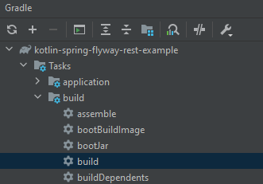
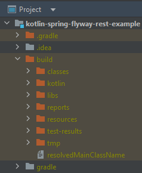
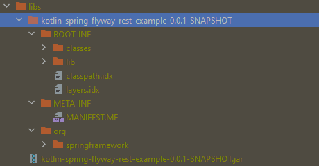

# JAR

> [!NOTE]
> Hensikten med denne øvelsen er å se konkret hva en JAR-fil består av.

Bygg prosjektet

Finn mappen `build` og se hva som ligger under der.

Gå til `build/libs`, her skal det ligge en `.jar`-fil. Extract (Open with Archive tool på Mac) denne filen og se hva den inneholder.

Noen spørsmål for å lede gjennomgangen;

- Hvordan ser MANIFEST.MF ut? Hva tror du de forskjellige feltene betyr?
- Hvor ligger dine kompilerte klasser?
- Hvor ligger avhengighetene til ditt program?
