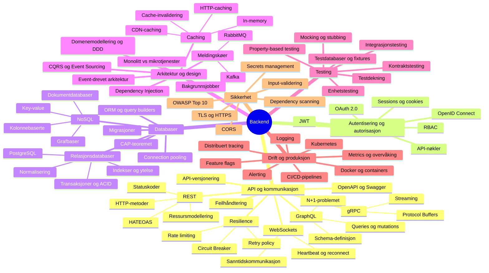

Sommerfaggruppe backend
===

## Hva er backend?

## Workshop

Installasjon er bseskrevet her: [installering](../installering.md)

### Lag et rest-api i Spring Boot

Du kan bruke IntelliJ for å gjøre disse oppgavene. 

1. [Lag et nytt prosjekt i Kotlin og Spring Boot](../del_0/nytt-prosjekt.md)
2. [Databaseintegrasjon](../del_1/database-integrasjon.md)
3. [REST](../del_2/Spring-REST.md)

### Lag et rest-api i Dotnet

Du må ha dotnet SDK installert for å gjøre disse oppgavene 

1. [Nytt prosjekt](dotnet/nytt-prosjekt.md)
2. [Databaseintegrasjon](dotnet/database-integrasjon.md)
3. [REST](dotnet/aspnet-REST.md)